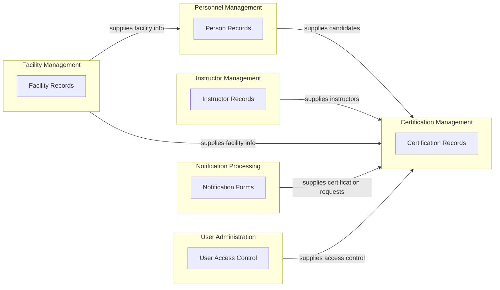
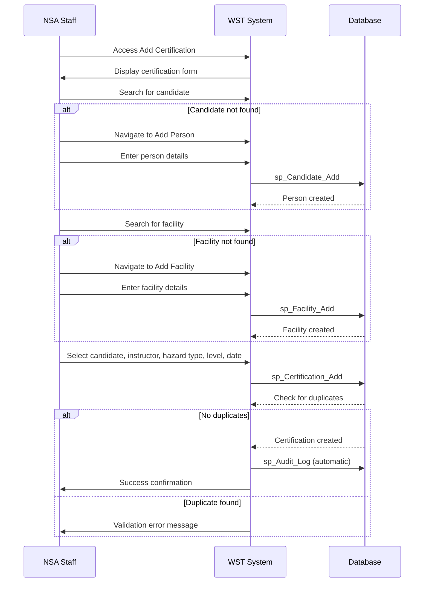
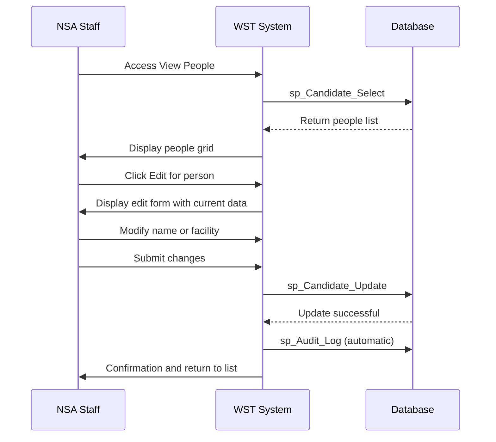
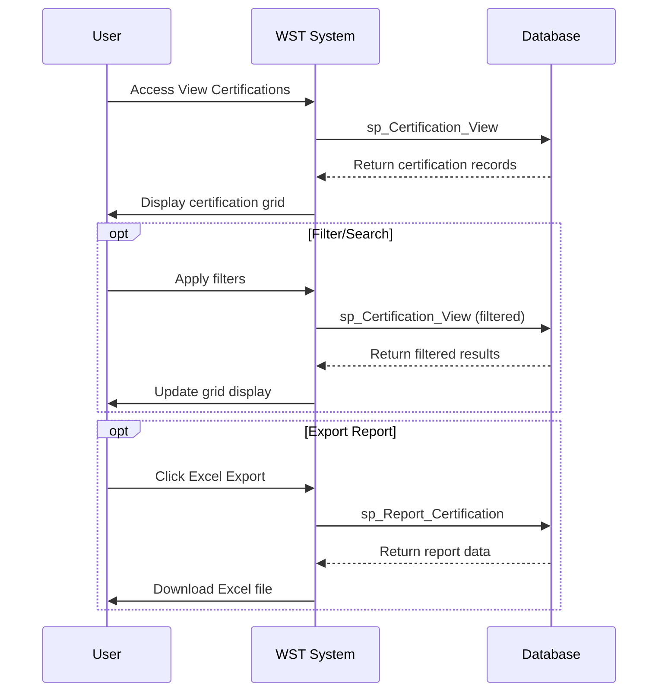
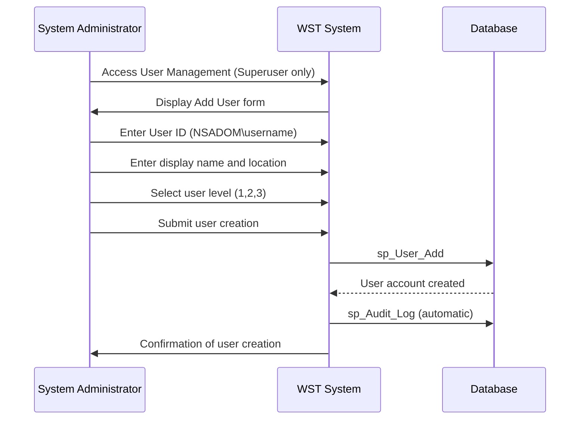
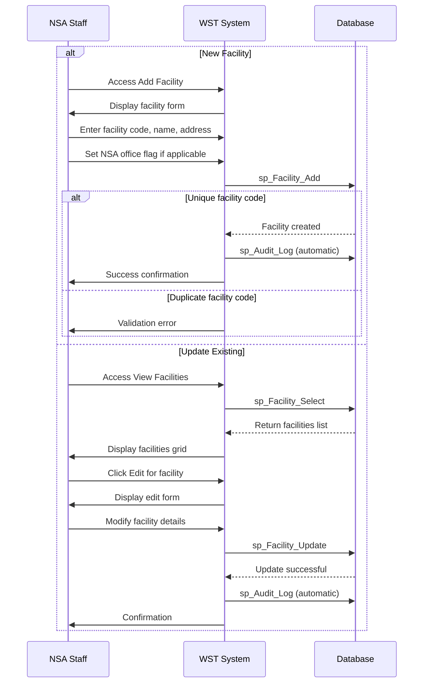

# Product Requirements Document: WST Certification Database

## 1. Overview

The WST (Workplace Safety Training) Certification Database is a mission-critical system that manages safety training records for personnel handling hazardous materials across NSA facilities. It serves as the authoritative record for safety certifications required by law and maintains compliance with workplace safety regulations.

The system supports NSA staff in processing certification notifications from facilities, tracking instructor qualifications, and maintaining comprehensive records of safety training events. It provides role-based access to certification data for NSA regional offices, facility administrators, and authorised personnel, ensuring that safety certification status can be verified for incident investigations and regulatory compliance.

The scope encompasses certification management for chemical, electrical, and mechanical hazards across multiple facility types, instructor assignment management, facility registration, user administration, and comprehensive audit logging to meet regulatory requirements.

## 2. Actors

| Actor | Description | Primary Activities |
|-------|-------------|-------------------|
| NSA Staff | National Safety Authority employees who process certification notifications and maintain the WST database | Process notification forms, add certifications, manage facilities and personnel |
| Facility Staff | Personnel at work facilities who handle hazardous materials and require safety certification | Subject to certification recording, appear as candidates in system |
| Regional Office Staff | NSA employees based at regional centres who may have access to the system | View regional certification data, manage local instructors |
| Certified Instructors | Qualified personnel (either NSA staff or previously certified facility staff) who provide safety certifications to candidates | Provide certifications, appear in instructor records |
| System Administrators | Personnel responsible for managing user accounts and system access within the WST application | Manage user accounts, configure system access levels |
| Superuser | System users with full access to all functions including user management | All CRUD operations, user administration, news management |
| Data Entry User | Users who can add, edit, delete records but cannot manage users | Person, instructor, facility, certification management |
| Read Only User | Users with view-only access to all data | View certification records, generate reports |

## 3. Domain Model

### 3.1 Bounded Contexts

#### Certification Management
- **Responsibility:** Managing the process of recording and maintaining certification records for personnel handling hazardous materials
- **Key terms:** Certification, Certification Level, Certified, Peer-Certified, Recertified, Hazard Type, Chemical, Electrical, Mechanical
- **Key entities:** Certification
- **Criticality:** Core — central to all primary workflows and mentioned across all analyses

#### Personnel Management
- **Responsibility:** Managing information about individuals who require or have received safety certifications
- **Key terms:** Person, Candidate, Person ID
- **Key entities:** Person/Candidate
- **Criticality:** Supporting — essential for certification process but supporting the core function

#### Instructor Management
- **Responsibility:** Managing the instructors who provide certifications and their association with regional offices
- **Key terms:** Instructor, Regional Office
- **Key entities:** Instructor, RegionalOffice
- **Criticality:** Supporting — essential for certification authority tracking

#### Facility Management
- **Responsibility:** Managing workplace facilities where hazardous materials are handled and certifications are required
- **Key terms:** Facility, Facility Code, NSA Office
- **Key entities:** Facility
- **Criticality:** Supporting — provides context for certifications

#### User Administration
- **Responsibility:** Managing system users and their access levels to the WST application
- **Key terms:** Superuser, Data Entry, Read Only
- **Key entities:** User
- **Criticality:** Peripheral — standard administrative function

#### Notification Processing
- **Responsibility:** Processing incoming notification forms from facilities requesting certification records
- **Key terms:** Notification Form, NSA
- **Key entities:** None (manual process)
- **Criticality:** Supporting — triggers certification workflows

### 3.2 Context Map



### 3.3 Entities

#### Personnel Management

##### Person

> Represents individuals who receive safety training certifications

| Property | Type | Required | Constraints | Source |
|----------|------|----------|-------------|--------|
| Candidate_No | integer | yes | Auto-generated sequential ID | application-analysis.md |
| CandidateName | string | yes | "surname, first name" format | application-analysis.md, interaction-analysis.md |
| Facility_Code | string | yes | Foreign key to Facility | application-analysis.md |

#### Instructor Management

##### Instructor

> Represents individuals authorised to provide safety training certifications

| Property | Type | Required | Constraints | Source |
|----------|------|----------|-------------|--------|
| Instructor_ID | integer | yes | Primary key identifier | application-analysis.md |
| InstructorName | string | yes | Instructor's full name | application-analysis.md, interaction-analysis.md |
| Office_ID | integer | yes | Foreign key to RegionalOffice | application-analysis.md |

##### RegionalOffice

> Represents regional offices where instructors are based

| Property | Type | Required | Constraints | Source |
|----------|------|----------|-------------|--------|
| Office_ID | integer | yes | Primary key, numeric values only | application-analysis.md |
| Office_Name | string | yes | Office display name | application-analysis.md, interaction-analysis.md |

#### Facility Management

##### Facility

> Represents physical locations where personnel are assigned

| Property | Type | Required | Constraints | Source |
|----------|------|----------|-------------|--------|
| Facility_Code | string | yes | Primary key, must be unique | application-analysis.md, interaction-analysis.md |
| Name | string | yes | Facility display name | application-analysis.md, interaction-analysis.md |
| Address_Line1 | string | no | First line of address | application-analysis.md, interaction-analysis.md |
| Address_Line2 | string | no | Second line of address | application-analysis.md |
| Address_Town | string | no | Town | application-analysis.md, interaction-analysis.md |
| Address_County | string | no | County | application-analysis.md |
| Address_PostCode | string | no | Postal code | application-analysis.md, interaction-analysis.md |
| Telephone | string | no | Phone number | application-analysis.md, interaction-analysis.md |
| Fax | string | no | Fax number | application-analysis.md, interaction-analysis.md |
| IsNSAOffice | boolean | no | Whether this is an NSA office | application-analysis.md, interaction-analysis.md |

#### Certification Management

##### Certification

> Represents a safety training certification record

| Property | Type | Required | Constraints | Source |
|----------|------|----------|-------------|--------|
| Candidate_No | integer | yes | Foreign key to Person | application-analysis.md, interaction-analysis.md |
| Instructor_ID | integer | yes | Foreign key to Instructor | application-analysis.md, interaction-analysis.md |
| Date_Certified | date | yes | DD/MM/YYYY format | application-analysis.md, interaction-analysis.md |
| Hazard_Type | enum(Chemical,Electrical,Mechanical) | yes | Type of hazard certification | application-analysis.md, interaction-analysis.md |
| CertLevel | enum(Peer-Certified,Certified,Recertified) | yes | Level of certification | application-analysis.md, interaction-analysis.md |

#### User Administration

##### User

> Represents system users with access permissions

| Property | Type | Required | Constraints | Source |
|----------|------|----------|-------------|--------|
| UserID | string | yes | Windows domain format (NSADOM\username) | application-analysis.md, interaction-analysis.md |
| UserName | string | yes | Display name | application-analysis.md, interaction-analysis.md |
| User_Office | integer | no | Associated regional office | application-analysis.md |
| UserLevel | enum(1,2,3) | yes | 1=Superuser, 2=Data entry, 3=Read only | application-analysis.md, interaction-analysis.md |

##### News

> Represents news items displayed on the home page

| Property | Type | Required | Constraints | Source |
|----------|------|----------|-------------|--------|
| Title | string | yes | News headline | application-analysis.md, interaction-analysis.md |
| NewsContent | string | yes | News article body | application-analysis.md |
| DatePublished | datetime | yes | Publication timestamp | application-analysis.md, interaction-analysis.md |
| Author | string | no | News author | application-analysis.md |

## 4. Key User Interfaces & Screens

### Home Page
- **Purpose:** Dashboard providing news updates and navigation hub for all system functions
- **URL/route pattern:** Default.aspx, WSTHome.aspx
- **Key fields:** User information display (name, role, domain), news articles with publication dates
- **Key actions:** Navigate to modules via dropdown menus (Person, Certification, Facility, User, News, Help, Reports)
- **Navigation:** Central hub linking to all other screens
- **Workflows:** All workflows start from this screen

### Add Person
- **Purpose:** Form for adding new candidates to the system
- **URL/route pattern:** WSTHome.aspx (view 1)
- **Key fields:** Name (surname, first name format) - required, Facility dropdown - required
- **Key actions:** Add Person button, Clear button
- **Navigation:** Person > Add a person
- **Workflows:** Record New Certification, Personnel Registration

### View People
- **Purpose:** Lists all candidates in the system with basic details
- **URL/route pattern:** WSTHome.aspx (view 3)
- **Key fields:** PersonID, Person name, PlantNo (facility code), facility Name
- **Key actions:** Edit link, Delete link for each person, pagination controls
- **Navigation:** Person > View people
- **Workflows:** Record New Certification, Update Person Information, View Certification History

### Edit Person
- **Purpose:** Allows modification of existing person records
- **URL/route pattern:** WSTHome.aspx (view 4)
- **Key fields:** Person ID (auto-generated), Name, Facility selection
- **Key actions:** Update person, Cancel/back to list
- **Navigation:** Via Edit link from View People screen
- **Workflows:** Update Person Information

### Add Instructor
- **Purpose:** Form for adding new instructors to the system
- **URL/route pattern:** WSTHome.aspx (view 5)
- **Key fields:** Instructor Name (required), Regional Office dropdown (required)
- **Key actions:** Add Instructor button, Clear button
- **Navigation:** Separate from person management due to different requirements
- **Workflows:** Manage Instructors

### Add Facility
- **Purpose:** Form for adding new facilities to the system
- **URL/route pattern:** WSTHome.aspx (view 13)
- **Key fields:** Facility Code (required), Facility Name (required), address fields, telephone, fax, NSA Office checkbox
- **Key actions:** Add Facility button, Clear button
- **Navigation:** Facility > Add facility
- **Workflows:** Record New Certification, Manage Facility Information

### View Facilities
- **Purpose:** Lists all facilities in the system
- **URL/route pattern:** WSTHome.aspx (view 15)
- **Key fields:** Facility code, name, NSA office indicator
- **Key actions:** Edit facility, view facility personnel
- **Navigation:** Facility > View facilities
- **Workflows:** Record New Certification, Manage Facility Information

### Add Certification
- **Purpose:** Form for recording new certification events
- **URL/route pattern:** WSTHome.aspx (view 9)
- **Key fields:** Candidate dropdown (required), Instructor dropdown (required), Hazard Type dropdown (required), Certification Level dropdown (required), Date (required)
- **Key actions:** Add Certification button, Clear button
- **Navigation:** Certification > Add certification
- **Workflows:** Record New Certification

### View Certifications
- **Purpose:** Lists all certification records in the system
- **URL/route pattern:** WSTHome.aspx (view 11)
- **Key fields:** ID, Candidate, Instructor, Hazard Type, Level, Date
- **Key actions:** Edit certification, Delete certification, pagination
- **Navigation:** Certification > View/alter/delete certification
- **Workflows:** View Certification History

### Add User
- **Purpose:** Form for adding new system users
- **URL/route pattern:** WSTHome.aspx (view 17)
- **Key fields:** User ID (Windows domain format), User name, User location, User level (role)
- **Key actions:** Add User button, Clear button
- **Navigation:** User > Add user
- **Workflows:** Add New System User

### Reports
- **Purpose:** Provides data export functionality for offline analysis
- **URL/route pattern:** WSTHome.aspx (view 25)
- **Key fields:** Export options description
- **Key actions:** Download All Tables (Excel format)
- **Navigation:** Reports menu item
- **Workflows:** Generate Reports

### Audit Log
- **Purpose:** Shows detailed system activity and changes for compliance
- **URL/route pattern:** Auditlog.aspx
- **Key fields:** ID, Stored Procedure, Parameters, User, Date/time
- **Key actions:** Filter by procedure, user, or date range
- **Navigation:** Separate administrative function
- **Workflows:** System audit and compliance reporting

## 5. Business Rules & Processes

### Certification Management

- **BR-001** — **Unique Certification per Hazard Type:** A candidate cannot have duplicate certifications for the same hazard type
  - **Criticality:** Core
  - **Source:** application-analysis.md

- **BR-002** — **Instructor-Candidate Self-Certification Prohibition:** A candidate cannot be certified by themselves - the candidate and instructor must be different people
  - **Criticality:** Core
  - **Source:** domain-analysis.md

- **BR-003** — **Certification Level Limitation:** Currently only one type of certification level can be assigned to a person for a given hazard type, leading to the creation of "Recertified" as a workaround
  - **Criticality:** Core
  - **Source:** domain-analysis.md

### Personnel Management

- **BR-004** — **Unique Person-Facility Assignment:** A person can only be registered once per facility
  - **Criticality:** Core
  - **Source:** application-analysis.md

- **BR-005** — **Required Person Name Format:** Person names must be entered in "surname, first name" format
  - **Criticality:** Supporting
  - **Source:** application-analysis.md, interaction-analysis.md

- **BR-006** — **Sequential Person ID Generation:** Person IDs are generated sequentially by the system and should not be manually editable
  - **Criticality:** Supporting
  - **Source:** domain-analysis.md

- **BR-007** — **Person Deletion Dependency:** A person record can only be deleted after all their associated certification records have been deleted first
  - **Criticality:** Core
  - **Source:** domain-analysis.md, application-analysis.md

- **BR-008** — **Historical Data Preservation:** People should not be deleted from the system even if they leave facilities, to maintain historical certification records for safety incident queries
  - **Criticality:** Core
  - **Source:** domain-analysis.md

### Facility Management

- **BR-009** — **Facility Code Uniqueness:** Facility codes must be unique across the system to prevent duplicate facilities
  - **Criticality:** Core
  - **Source:** domain-analysis.md, application-analysis.md

- **BR-010** — **Facility Assignment Required:** Persons must be assigned to a facility upon registration
  - **Criticality:** Supporting
  - **Source:** application-analysis.md

- **BR-011** — **Facility Deletion Protection:** Facilities with assigned personnel cannot be deleted
  - **Criticality:** Core
  - **Source:** application-analysis.md

### Instructor Management

- **BR-012** — **Instructor Regional Office Association:** An instructor must be linked to a regional office
  - **Criticality:** Supporting
  - **Source:** domain-analysis.md, application-analysis.md

- **BR-013** — **Instructor Deletion Protection:** An instructor cannot be deleted if they have certification records linked to them
  - **Criticality:** Core
  - **Source:** domain-analysis.md, application-analysis.md

### User Administration

- **BR-014** — **Windows Authentication Required:** All users must authenticate via Windows domain accounts
  - **Criticality:** Core
  - **Source:** application-analysis.md

- **BR-015** — **Authorised User Registration:** Only registered users in the database can access the system
  - **Criticality:** Core
  - **Source:** application-analysis.md

- **BR-016** — **User Domain Format:** User IDs must follow domain format (default NSADOM\)
  - **Criticality:** Supporting
  - **Source:** application-analysis.md, interaction-analysis.md

- **BR-017** — **Role-Based Function Access:** Superusers only can manage users and news; Data entry excluded from some views
  - **Criticality:** Core
  - **Source:** application-analysis.md

### Data Quality

- **BR-018** — **Certification Date Validation:** Certification dates must be valid dates in DD/MM/YYYY format
  - **Criticality:** Supporting
  - **Source:** application-analysis.md

- **BR-019** — **Numeric Office ID Validation:** Regional office IDs must be numeric values
  - **Criticality:** Supporting
  - **Source:** application-analysis.md

- **BR-020** — **Audit Trail Mandatory:** All write operations except excluded procedures must be logged
  - **Criticality:** Core
  - **Source:** application-analysis.md

## 6. Workflows

### Record New Certification

- **Description:** Process a notification form from a facility to officially record a safety certification in the system. This workflow ensures that both personnel and facility records exist before creating the certification record, maintaining data integrity across the system.
- **Trigger:** Notification form received from a facility requesting certification to be recorded



### Update Person Information

- **Description:** Modify existing person records when personnel details change, such as name corrections or facility transfers. The workflow maintains referential integrity by validating facility assignments and preserving historical certification links.
- **Trigger:** Name change notification or facility transfer requires person record update



### View Certification History

- **Description:** Query certification records to verify training status for compliance checks or incident investigations. Provides comprehensive view of individual or facility-wide certification status with export capabilities for external reporting.
- **Trigger:** Query about person's certification status or facility personnel review



### Add New System User

- **Description:** Create user accounts for new team members with appropriate role-based access levels. Ensures proper Windows domain integration and role assignment based on job function and security requirements.
- **Trigger:** New team member requires access to WST system



### Manage Facility Information

- **Description:** Maintain facility database with accurate information for certification tracking. Supports adding new facilities for expanding operations and updating existing facility details when changes occur.
- **Trigger:** New facility registration or facility name/address change



## 7. Computed Fields & Formulas

No computed fields or formulas were identified in the available analysis files.

## 8. Reports & Analytics

| Report | Purpose | Data sources | Filters/parameters | Output format | Source |
|--------|---------|-------------|-------------------|---------------|--------|
| Comprehensive Export | Export all system data to Excel workbook for offline analysis and backup | sp_Report_Facility, sp_Report_Candidate, sp_Report_Instructor, sp_Report_Certification, sp_Report_NSA | None | Excel (.xlsx) with 5 worksheets | application-analysis.md |
| Audit Log | Display audit trail of system operations for compliance and investigation | sp_Audit_log_Get | Stored procedure filter, date range, user filter | HTML GridView | application-analysis.md |
| Audit Log Archive | Display archived audit records for historical compliance reporting | Database tables | None | HTML GridView | application-analysis.md |

## 9. Behaviour

### Certification Management

```gherkin
Scenario: Record valid certification
  Given a person exists in the system
  And an instructor exists in the system
  And the person has no existing certification for the selected hazard type
  When I add a certification with candidate, instructor, hazard type, level, and valid date
  Then the certification is saved
  And an audit log entry is created

Scenario: Prevent duplicate certification
  Given a person has an existing certification for Chemical hazard type
  When I attempt to add another Chemical certification for the same person
  Then the system displays a validation error
  And no certification record is created

Scenario: Prevent self-certification
  Given a person exists as both candidate and instructor
  When I attempt to assign the person as instructor for their own certification
  Then the system should prevent this assignment
```

### Personnel Management

```gherkin
Scenario: Add new person with valid details
  Given a facility exists in the system
  When I enter a person name in "surname, firstname" format
  And I select a valid facility
  Then the person is created with a sequential Person ID
  And the person is assigned to the selected facility

Scenario: Prevent person deletion with certifications
  Given a person has certification records
  When I attempt to delete the person
  Then the system displays an error message
  And the person record is not deleted

Scenario: Update person facility assignment
  Given a person exists in the system
  When I change their facility assignment
  Then the person's facility is updated
  And existing certifications remain linked to the person
```

### User Access Control

```gherkin
Scenario: Superuser accesses all functions
  Given I am logged in as a Superuser (Level 1)
  When I navigate to any screen
  Then all functions are enabled
  And I can manage users and news

Scenario: Data entry user restricted access
  Given I am logged in as Data entry user (Level 2)
  When I navigate to user management
  Then I am denied access
  And I see an unauthorised access message

Scenario: Read-only user cannot modify data
  Given I am logged in as Read Only user (Level 3)
  When I view any data screen
  Then all input controls are disabled
  And I can only view and export data
```

### Facility Management

```gherkin
Scenario: Add facility with unique code
  Given no facility exists with code "FAC001"
  When I enter facility details with code "FAC001"
  Then the facility is created successfully

Scenario: Prevent duplicate facility codes
  Given a facility exists with code "FAC001"
  When I attempt to create another facility with code "FAC001"
  Then the system displays a validation error
  And the facility is not created

Scenario: Prevent facility deletion with assigned personnel
  Given a facility has personnel assigned
  When I attempt to delete the facility
  Then the system prevents deletion
  And displays an appropriate error message
```

## 10. Roles & Permissions

| Role | Description | Permissions |
|------|-------------|-------------|
| Superuser (Level 1) | Full system administrator | All CRUD operations, user management, news management, all system functions |
| Data Entry (Level 2) | Operational users for certification management | Add/edit/delete persons, instructors, facilities, certifications; view all data; generate reports; cannot manage users or news |
| Read Only (Level 3) | View-only access for queries and reporting | View all data, generate reports; all input controls disabled |

## 11. Security Constraints

- Users must authenticate via Windows domain accounts before accessing any screen
- Only users registered in the WST database can access the system; unregistered domain users are redirected to unauthorised access page
- Session management is handled through ASP.NET with Windows Authentication integration
- Role-based access control prevents users from accessing functions above their permission level
- All database write operations are automatically logged with user identity, timestamp, and operation details for audit compliance
- Unauthorised access attempts are blocked and logged
- File upload paths are restricted to configured directories only

## 12. External Systems & Integrations

| System | Direction | Protocol | Purpose | Source |
|--------|-----------|----------|---------|--------|
| Windows Domain (NSADOM) | inbound | Windows Authentication | User authentication and identity management | application-analysis.md |
| SMTP Server | outbound | email | System error notifications and alerts | application-analysis.md |
| File System | bidirectional | file I/O | Excel template access and report generation | application-analysis.md |

## 13. API Contracts

No external API contracts were identified in the available analysis files. The application appears to be an internal system without exposed APIs for external consumers.

## 14. Open Questions

1. **Missing Database Analysis:** The database-analysis.md file was not available during PRD generation. This limits visibility into data model constraints, foreign key relationships, indexes, and stored procedure definitions that could affect the accuracy of entity definitions and business rules.

2. **Certification Level Business Rules:** The domain analysis indicates "Recertified" status was created as a workaround because the system cannot handle multiple certification types for one person, but the exact technical constraint preventing this is unclear without database schema details.

3. **Email Integration Configuration:** The application analysis mentions SMTP server integration for notifications, but the specific triggers, recipients, and message formats for these notifications are not documented in the interaction or domain analyses.

4. **Excel Template Dependencies:** The reporting functionality references an Excel template at ~/Reports/WST.xlsx, but the structure and requirements of this template are not described in any analysis.

5. **Facility Edit Limitations:** The interaction analysis notes that users must access the backend database directly to edit facility names due to frontend restrictions, but the specific technical limitation causing this is not explained.

6. **Hazard Type Business Logic:** The domain analysis mentions Electrical and Mechanical hazard types are "combined" and "follow the same certification process," but whether these are stored as separate values or a single combined value is unclear.

7. **Data Validation Gaps:** The interaction analysis identifies that the system allows duplicate facility codes and self-certification workarounds, but whether these are intentional business requirements or technical limitations is not specified.

## 15. Known Limitations & Deficiencies

- **Multiple certification limitation:** The system cannot assign multiple certification types to one person for a given hazard type, leading to the creation of "Recertified" status as a workaround for refresher training
- **Facility editing restriction:** Users cannot edit facility names through the frontend interface and must access the backend database directly when facilities change ownership or merge
- **Manual duplicate checking:** Users must manually verify that people and facilities don't already exist before adding new records due to lack of automated duplicate validation
- **Self-certification allowed:** The system does not prevent a candidate and instructor from being the same person during certification entry
- **Validation gaps:** System allows duplicate facility codes and multiple certifications on the same day without validation
- **Frontend edit limitations:** Some facility management functions are restricted in the user interface requiring backend database access

## 16. Data Migration Considerations

**Data migration factors cannot be fully assessed without the database analysis.** Key considerations based on application analysis:

- **Sequential ID preservation:** Person IDs are auto-generated sequentially and must be preserved during migration to maintain referential integrity with certification records
- **Reference data seeding:** Regional offices, hazard types (Chemical, Electrical, Mechanical), and certification levels (Peer-Certified, Certified, Recertified) must be seeded in the new system
- **User account mapping:** Windows domain authentication integration requires mapping existing NSADOM\ user accounts to new system roles
- **Audit log preservation:** Historical audit trails must be preserved for regulatory compliance
- **Excel template migration:** The reporting template structure at ~/Reports/WST.xlsx must be recreated or converted for the new system

## 17. Non-Functional Requirements

### Performance
- **Report generation timeout:** Excel export functionality suggests potential for large data volumes requiring performance consideration for report generation
- **Pagination support:** The interaction analysis shows pagination controls on data grids, indicating current system handles large record sets

### Availability
- **Windows Authentication dependency:** System availability depends on Windows domain controller accessibility
- **SMTP dependency:** Error notification functionality depends on internal mail server availability

### Audit and Logging
- **Comprehensive audit trail:** All write operations must be logged with stored procedure name, parameters, user identity, and timestamp for regulatory compliance
- **Audit log archiving:** System includes audit log archival functionality indicating long-term retention requirements
- **Usage tracking:** Application includes usage statistics logging separate from audit trail

## 18. Glossary

| Term | Definition |
|------|------------|
| Candidate | A person who is being certified or has been certified for handling hazardous materials at a facility |
| Certification | The practical safety handling qualification that demonstrates a person can accurately and safely handle hazardous materials of a specific type |
| Certification Level | The type of certification: Certified (by NSA staff), Peer-Certified (by previously certified facility staff), or Recertified (refresher certification) |
| Certified | Top tier certification where an NSA member of staff has certified someone from a facility |
| Chemical | One of the hazard types for which personnel can be certified, involving safe handling and disposal of chemical hazardous materials |
| Data Entry | A user access level that allows adding and editing records but not managing users |
| Electrical | One of the hazard types for certification, currently only used when someone is certified in both Electrical and Mechanical |
| Facility | A workplace where staff handle hazardous materials and require safety certification, identified by facility code and name |
| Facility Code | A unique identifier for each facility where certifications take place |
| Hazard Type | The category of hazardous material for which certification is provided: Chemical, or Electrical and Mechanical (combined) |
| Instructor | A person qualified to provide certification to candidates, linked to a regional office |
| Mechanical | One of the hazard types for certification, currently combined with Electrical as they follow the same certification process |
| NSA | National Safety Authority, the organisation responsible for workplace safety certification oversight |
| NSA Office | A facility that is an NSA headquarters or regional centre, distinguished from regular work facilities |
| Notification Form | The document sent by facilities to NSA containing details of a person, facility and certification that needs to be recorded |
| Peer-Certified | A certification level where someone who has previously been certified can certify another member of staff |
| Person | An individual who works at a facility and requires or has certification for handling hazardous materials |
| Person ID | A sequential number generated by the system to uniquely identify each person in the database |
| Read Only | A user access level that allows viewing records but no modifications |
| Recertified | A certification level used for refresher certification, created because the system cannot add multiple certification types for one person |
| Regional Office | NSA offices that manage certification activities in specific geographic areas |
| Superuser | The highest user access level that can perform all operations including user management |
| WST | Workplace Safety Training certification database system |

## 19. Sources

- **output/domain-analysis.md** — Generated from curated transcript and HTML mockups; contributed domain model, bounded contexts, business rules, and ubiquitous language definitions. Input files: output/transcripts/wst_demo_curated.txt, output/html/*.html
- **output/interaction-analysis.md** — Generated from 38 HTML mockups and curated transcript; contributed screen inventory, user workflows, navigation patterns, and user interface specifications. Input files: output/html/01_home.html through output/html/38_file_not_found.html, output/transcripts/wst_demo_curated.txt
- **output/application-analysis.md** — Generated from VB.NET source code; contributed technical architecture, business rules, entity definitions, stored procedure mappings, and workflow implementations. Input files: src/defra-wst/src/WST/ directory containing .sln, .vbproj, .aspx, .vb, .config, and .sitemap files

**Raw material summary:** 38 screenshots, 1 curated stakeholder transcript, 19 source code files representing a complete VB.NET web application with SQL Server backend integration.