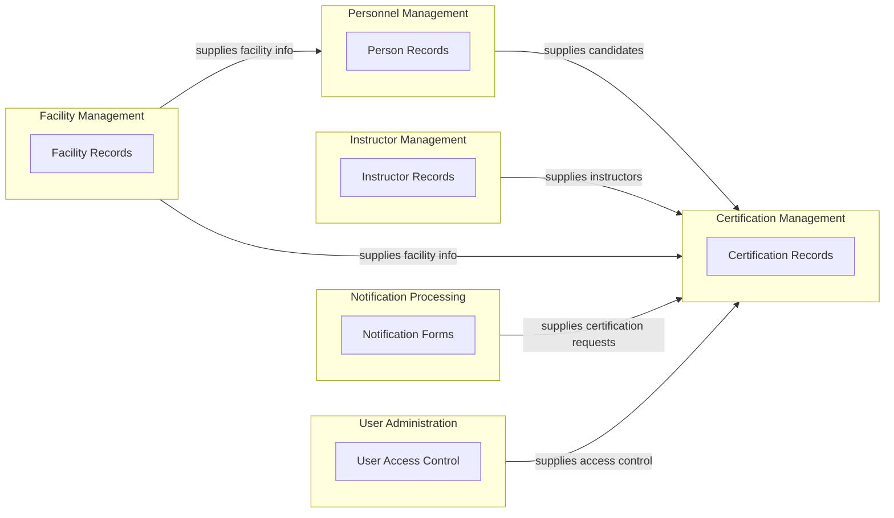

# WST Domain Analysis

<!-- Input files processed:
- output/transcripts/wst_demo_curated.txt
- output/html/01_home.html
- output/html/17_certification_add.html
- output/html/24_user_add.html
- output/html/06_candidate_add.html
- output/html/13_facility_add.html
- output/html/10_instructor_add.html
-->

## 1. Ubiquitous Language

| Term | Definition | Source |
|------|------------|--------|
| Candidate | A person who is being certified or has been certified for handling hazardous materials at a facility | output/transcripts/wst_demo_curated.txt, output/html/17_certification_add.html |
| Certification | The practical safety handling qualification that demonstrates a person can accurately and safely handle hazardous materials of a specific type | output/transcripts/wst_demo_curated.txt |
| Certification Level | The type of certification: Certified (by NSA staff), Peer-Certified (by previously certified facility staff), or Recertified (refresher certification) | output/transcripts/wst_demo_curated.txt, output/html/17_certification_add.html |
| Certified | Top tier certification where an NSA member of staff has certified someone from a facility | output/transcripts/wst_demo_curated.txt |
| Chemical | One of the hazard types for which personnel can be certified, involving safe handling and disposal of chemical hazardous materials | output/transcripts/wst_demo_curated.txt, output/html/17_certification_add.html |
| Data Entry | A user access level that allows adding and editing records but not managing users | output/transcripts/wst_demo_curated.txt, output/html/24_user_add.html |
| Electrical | One of the hazard types for certification, currently only used when someone is certified in both Electrical and Mechanical | output/transcripts/wst_demo_curated.txt |
| Facility | A workplace where staff handle hazardous materials and require safety certification, identified by facility code and name | output/transcripts/wst_demo_curated.txt, output/html/13_facility_add.html |
| Facility Code | A unique identifier for each facility where certifications take place | output/transcripts/wst_demo_curated.txt, output/html/13_facility_add.html |
| Hazard Type | The category of hazardous material for which certification is provided: Chemical, or Electrical and Mechanical (combined) | output/transcripts/wst_demo_curated.txt |
| Instructor | A person qualified to provide certification to candidates, linked to a regional office | output/transcripts/wst_demo_curated.txt, output/html/10_instructor_add.html |
| Mechanical | One of the hazard types for certification, currently combined with Electrical as they follow the same certification process | output/transcripts/wst_demo_curated.txt |
| NSA | National Safety Authority, the organisation responsible for workplace safety certification oversight | output/transcripts/wst_demo_curated.txt, output/html/01_home.html |
| NSA Office | A facility that is an NSA headquarters or regional centre, distinguished from regular work facilities | output/transcripts/wst_demo_curated.txt, output/html/13_facility_add.html |
| Notification Form | The document sent by facilities to NSA containing details of a person, facility and certification that needs to be recorded | output/transcripts/wst_demo_curated.txt |
| Peer-Certified | A certification level where someone who has previously been certified can certify another member of staff | output/transcripts/wst_demo_curated.txt |
| Person | An individual who works at a facility and requires or has certification for handling hazardous materials | output/transcripts/wst_demo_curated.txt, output/html/06_candidate_add.html |
| Person ID | A sequential number generated by the system to uniquely identify each person in the database | output/transcripts/wst_demo_curated.txt |
| Read Only | A user access level that allows viewing records but no modifications | output/transcripts/wst_demo_curated.txt, output/html/24_user_add.html |
| Recertified | A certification level used for refresher certification, created because the system cannot add multiple certification types for one person | output/transcripts/wst_demo_curated.txt |
| Regional Office | NSA offices that manage certification activities in specific geographic areas | output/transcripts/wst_demo_curated.txt, output/html/10_instructor_add.html |
| Superuser | The highest user access level that can perform all operations including user management | output/transcripts/wst_demo_curated.txt, output/html/24_user_add.html |
| WST | Workplace Safety Training certification database system | output/transcripts/wst_demo_curated.txt, output/html/01_home.html |

## 2. Bounded Contexts

#### Certification Management
- **Responsibility:** Managing the process of recording and maintaining certification records for personnel handling hazardous materials
- **Key terms:** Certification, Certification Level, Certified, Peer-Certified, Recertified, Hazard Type, Chemical, Electrical, Mechanical
- **Transcript references:** output/transcripts/wst_demo_curated.txt

#### Personnel Management
- **Responsibility:** Managing information about individuals who require or have received safety certifications
- **Key terms:** Person, Candidate, Person ID
- **Transcript references:** output/transcripts/wst_demo_curated.txt

#### Instructor Management
- **Responsibility:** Managing the instructors who provide certifications and their association with regional offices
- **Key terms:** Instructor, Regional Office
- **Transcript references:** output/transcripts/wst_demo_curated.txt

#### Facility Management
- **Responsibility:** Managing workplace facilities where hazardous materials are handled and certifications are required
- **Key terms:** Facility, Facility Code, NSA Office
- **Transcript references:** output/transcripts/wst_demo_curated.txt

#### User Administration
- **Responsibility:** Managing system users and their access levels to the WST application
- **Key terms:** Superuser, Data Entry, Read Only
- **Transcript references:** output/transcripts/wst_demo_curated.txt

#### Notification Processing
- **Responsibility:** Processing incoming notification forms from facilities requesting certification records
- **Key terms:** Notification Form, NSA
- **Transcript references:** output/transcripts/wst_demo_curated.txt

## 3. Subdomains

#### Certification Management
- **Type:** core
- **Bounded context:** Certification Management
- **Rationale:** This is the primary business function of the WST system - recording safety certifications is the core value proposition
- **Transcript references:** output/transcripts/wst_demo_curated.txt

#### Personnel Management
- **Type:** supporting
- **Bounded context:** Personnel Management
- **Rationale:** Supporting the core certification function by maintaining candidate information, but not the primary value driver
- **Transcript references:** output/transcripts/wst_demo_curated.txt

#### Instructor Management
- **Type:** supporting
- **Bounded context:** Instructor Management
- **Rationale:** Essential for certification process but supporting the core certification recording function
- **Transcript references:** output/transcripts/wst_demo_curated.txt

#### Facility Management
- **Type:** supporting
- **Bounded context:** Facility Management
- **Rationale:** Supporting subdomain that provides context for where certifications occur
- **Transcript references:** output/transcripts/wst_demo_curated.txt

#### User Administration
- **Type:** generic
- **Bounded context:** User Administration
- **Rationale:** Standard system administration functionality that could be replaced by generic identity management solutions
- **Transcript references:** output/transcripts/wst_demo_curated.txt

#### Notification Processing
- **Type:** supporting
- **Bounded context:** Notification Processing
- **Rationale:** Supports the core certification process by handling incoming requests but is not the primary business function
- **Transcript references:** output/transcripts/wst_demo_curated.txt

## 4. Context Map

#### 4.1 Relationship Table

| Upstream Context | Downstream Context | Relationship Type | Description | Source |
|------------------|--------------------|-------------------|-------------|--------|
| Personnel Management | Certification Management | customer-supplier | Personnel Management supplies candidate information to Certification Management for creating certification records | output/transcripts/wst_demo_curated.txt |
| Instructor Management | Certification Management | customer-supplier | Instructor Management supplies instructor information to Certification Management for recording who provided certifications | output/transcripts/wst_demo_curated.txt |
| Facility Management | Certification Management | customer-supplier | Facility Management supplies facility information to Certification Management for recording where certifications occurred | output/transcripts/wst_demo_curated.txt |
| Facility Management | Personnel Management | customer-supplier | Facility Management supplies facility information to Personnel Management as candidates are associated with facilities | output/transcripts/wst_demo_curated.txt |
| Notification Processing | Certification Management | customer-supplier | Notification Processing supplies certification requests to Certification Management for processing | output/transcripts/wst_demo_curated.txt |
| User Administration | Certification Management | customer-supplier | User Administration supplies authentication and authorisation information to control access to certification functions | output/transcripts/wst_demo_curated.txt |

#### 4.2 Context Map Diagram

## 5. Actors and Stakeholders

| Actor / Stakeholder | Role Description | Source |
|---------------------|------------------|--------|
| NSA Staff | National Safety Authority employees who process certification notifications and maintain the WST database | output/transcripts/wst_demo_curated.txt |
| Facility Staff | Personnel at work facilities who handle hazardous materials and require safety certification | output/transcripts/wst_demo_curated.txt |
| Regional Office Staff | NSA employees based at regional centres who may have access to the system | output/transcripts/wst_demo_curated.txt |
| Certified Instructors | Qualified personnel (either NSA staff or previously certified facility staff) who provide safety certifications to candidates | output/transcripts/wst_demo_curated.txt |
| System Administrators | Personnel responsible for managing user accounts and system access within the WST application | output/transcripts/wst_demo_curated.txt |

## 6. Domain Rules and Invariants

| ID | Rule | Description | Source |
|------|------|-------------|--------|
| DR-001 | Instructor-Candidate Self-Certification Prohibition | A candidate cannot be certified by themselves - the candidate and instructor must be different people | output/transcripts/wst_demo_curated.txt |
| DR-002 | Person Deletion Dependency | A person record can only be deleted after all their associated certification records have been deleted first | output/transcripts/wst_demo_curated.txt |
| DR-003 | Instructor Deletion Protection | An instructor cannot be deleted if they have certification records linked to them | output/transcripts/wst_demo_curated.txt |
| DR-004 | Facility Code Uniqueness | Facility codes should be unique across the system to prevent duplicate facilities | output/transcripts/wst_demo_curated.txt |
| DR-005 | Sequential Person ID Generation | Person IDs are generated sequentially by the system and should not be manually editable | output/transcripts/wst_demo_curated.txt |
| DR-006 | Certification Level Limitation | Currently only one type of certification level can be assigned to a person for a given hazard type, leading to the creation of "Recertified" as a workaround | output/transcripts/wst_demo_curated.txt |
| DR-007 | Instructor Regional Office Association | An instructor must be linked to a regional office | output/transcripts/wst_demo_curated.txt |
| DR-008 | Historical Data Preservation | People should not be deleted from the system even if they leave facilities, to maintain historical certification records for safety incident queries | output/transcripts/wst_demo_curated.txt |