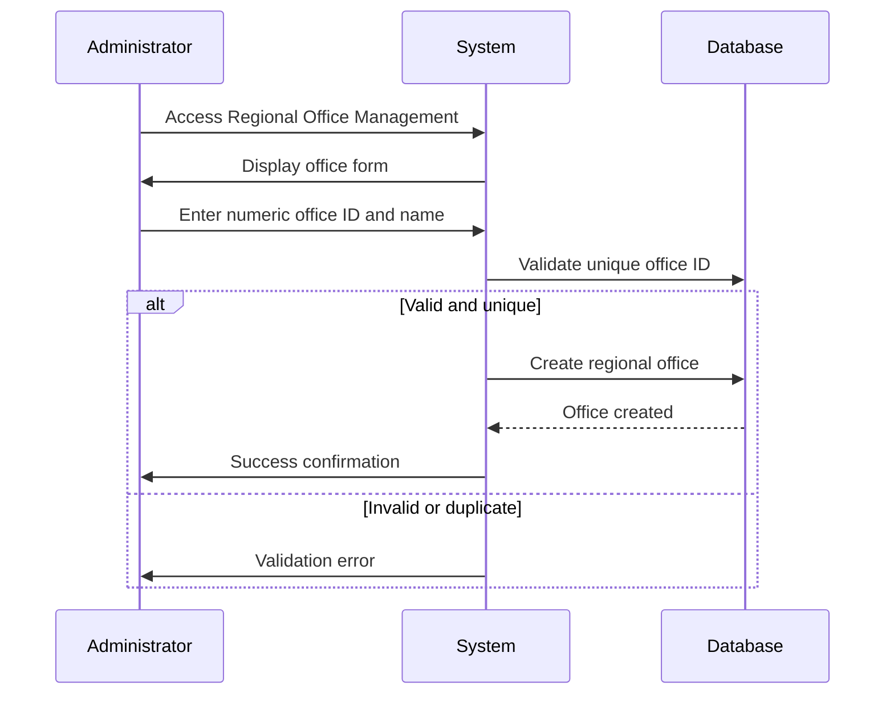

# Feature Specification: Reference Data Management

**Feature ID:** FT-001  
**Title:** Reference Data Management  
**Priority:** Must Have  
**Layer:** 0

## Overview

This feature provides the foundational reference data required by all other features in the WST system. It manages the lookup tables and enumerated values that define hazard types, certification levels, and regional offices used throughout the application.

## User Stories

### US-001: Manage Hazard Types
**As a** system administrator  
**I want** to manage the hazard type reference data  
**So that** certifications can be properly categorized by Chemical, Electrical, and Mechanical types

**Acceptance Criteria:**
- Hazard types (Chemical, Electrical, Mechanical) are stored as enumerated values
- Each hazard type has a unique identifier and display name
- The system prevents deletion of hazard types with existing certifications
- Electrical and Mechanical types are combined for certification purposes

### US-002: Manage Certification Levels
**As a** system administrator  
**I want** to manage certification level reference data  
**So that** certifications can be properly classified by level

**Acceptance Criteria:**
- Certification levels (Peer-Certified, Certified, Recertified) are stored as enumerated values
- Each level has a unique identifier and display name
- The system prevents deletion of levels with existing certifications
- "Recertified" level supports refresher training scenarios

### US-003: Manage Regional Offices
**As a** system administrator  
**I want** to manage regional office reference data  
**So that** instructors can be properly associated with their offices

**Acceptance Criteria:**
- Regional offices can be added with numeric ID and name
- Office IDs must be numeric values only
- Each office has a unique identifier and display name
- The system prevents deletion of offices with assigned instructors

## Dependencies

**Upstream:** None  
**Downstream:** FT-002 (Facility Management), FT-003 (Personnel Management), FT-004 (Instructor Management)

## Business Rules

From PRD Section 5:

- **BR-019** — Regional office IDs must be numeric values
- **BR-003** — Currently only one type of certification level can be assigned to a person for a given hazard type

## Actors

From PRD Section 2:
- **System Administrators** — Manage reference data and system configuration
- **Superuser** — Full access to all functions including reference data management

## Entities

### Regional Office (from PRD Section 3.3)
| Property | Type | Required | Constraints |
|----------|------|----------|-------------|
| Office_ID | integer | yes | Primary key, numeric values only |
| Office_Name | string | yes | Office display name |

### Enumerated Values
- **Hazard Types:** Chemical, Electrical, Mechanical
- **Certification Levels:** Peer-Certified, Certified, Recertified

## Key Interfaces

### Regional Office Management
- **Purpose:** Manage the regional offices where instructors are based
- **Key fields:** Office ID (numeric), Office Name
- **Key actions:** Add office, edit office, view offices list
- **Navigation:** Administrative interface

## Workflows

### Add Regional Office

## Success Criteria

- All hazard types are properly defined and available for certification assignment
- All certification levels are properly defined and support business workflows
- Regional offices are properly managed with numeric IDs
- Reference data integrity is maintained across the system
- Deletion protection prevents orphaned references

## Open Questions

- Should hazard types be configurable or fixed enumerated values?
- Are there plans to separate Electrical and Mechanical hazard types in the future?
- What is the business process for adding new regional offices?