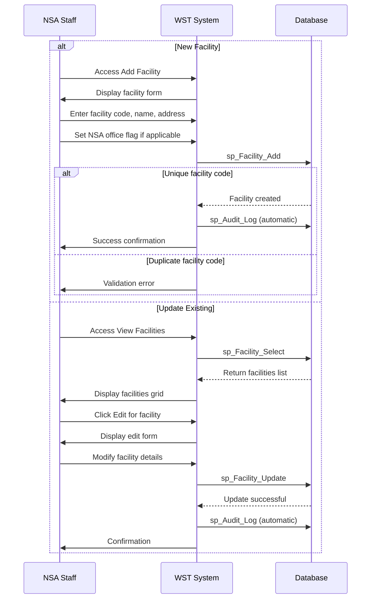

# Feature Specification: Facility Management

**Feature ID:** FT-002  
**Title:** Facility Management  
**Priority:** Must Have  
**Layer:** 1

## Overview

This feature manages workplace facilities where personnel handle hazardous materials and require safety certification. It provides comprehensive facility registration, information management, and validation to ensure accurate facility records for certification tracking.

## User Stories

### US-004: Add New Facility
**As an** NSA staff member  
**I want** to add new facilities to the system  
**So that** personnel at those facilities can receive certifications

**Acceptance Criteria:**
- Facility code and name are required fields
- Facility code must be unique across the system
- Address fields (line1, line2, town, county, postcode) are optional
- Contact information (telephone, fax) can be stored
- NSA office flag can be set to identify NSA facilities
- System validates facility code uniqueness before creation
- Audit log entry is created for new facilities

### US-005: View Facility List
**As an** NSA staff member  
**I want** to view all facilities in the system  
**So that** I can select facilities for personnel assignment and certification

**Acceptance Criteria:**
- All facilities are displayed in a paginated list
- Facility code, name, and NSA office indicator are visible
- Edit and view personnel links are available for each facility
- List supports pagination for large numbers of facilities
- NSA offices are clearly distinguished from regular facilities

### US-006: Edit Facility Information
**As an** NSA staff member  
**I want** to update facility information  
**So that** facility records remain current and accurate

**Acceptance Criteria:**
- All facility fields can be updated except facility code
- Address and contact information can be modified
- NSA office status can be changed
- System validates data before saving changes
- Audit log entry is created for facility updates
- Cannot delete facilities with assigned personnel

### US-007: Prevent Facility Data Corruption
**As a** system administrator  
**I want** the system to protect facility data integrity  
**So that** certification records remain valid

**Acceptance Criteria:**
- Facilities with assigned personnel cannot be deleted
- Duplicate facility codes are prevented
- Referential integrity is maintained with personnel assignments
- Error messages clearly explain validation failures

## Dependencies

**Upstream:** FT-001 (Reference Data Management)  
**Downstream:** FT-003 (Personnel Management), FT-005 (Certification Management)

## Business Rules

From PRD Section 5:

- **BR-009** — Facility codes must be unique across the system to prevent duplicate facilities
- **BR-010** — Persons must be assigned to a facility upon registration
- **BR-011** — Facilities with assigned personnel cannot be deleted

## Actors

From PRD Section 2:
- **NSA Staff** — Process certification notifications and maintain the WST database
- **System Administrators** — Manage user accounts and system access
- **Superuser** — Full access to all functions
- **Data Entry User** — Can add, edit, delete facility records

## Entities

### Facility (from PRD Section 3.3)
| Property | Type | Required | Constraints |
|----------|------|----------|-------------|
| Facility_Code | string | yes | Primary key, must be unique |
| Name | string | yes | Facility display name |
| Address_Line1 | string | no | First line of address |
| Address_Line2 | string | no | Second line of address |
| Address_Town | string | no | Town |
| Address_County | string | no | County |
| Address_PostCode | string | no | Postal code |
| Telephone | string | no | Phone number |
| Fax | string | no | Fax number |
| IsNSAOffice | boolean | no | Whether this is an NSA office |

## Key Interfaces

### Add Facility (from PRD Section 4)
- **Purpose:** Form for adding new facilities to the system
- **URL/route pattern:** WSTHome.aspx (view 13)
- **Key fields:** Facility Code (required), Facility Name (required), address fields, telephone, fax, NSA Office checkbox
- **Key actions:** Add Facility button, Clear button
- **Navigation:** Facility > Add facility

### View Facilities (from PRD Section 4)
- **Purpose:** Lists all facilities in the system
- **URL/route pattern:** WSTHome.aspx (view 15)
- **Key fields:** Facility code, name, NSA office indicator
- **Key actions:** Edit facility, view facility personnel
- **Navigation:** Facility > View facilities

## Workflows

From PRD Section 6:

### Manage Facility Information


## Behaviour

From PRD Section 9:

```gherkin
Scenario: Add facility with unique code
  Given no facility exists with code "FAC001"
  When I enter facility details with code "FAC001"
  Then the facility is created successfully

Scenario: Prevent duplicate facility codes
  Given a facility exists with code "FAC001"
  When I attempt to create another facility with code "FAC001"
  Then the system displays a validation error
  And the facility is not created

Scenario: Prevent facility deletion with assigned personnel
  Given a facility has personnel assigned
  When I attempt to delete the facility
  Then the system prevents deletion
  And displays an appropriate error message
```

## Security & Access Control

From PRD Section 10:
- **Superuser (Level 1):** Full facility management access
- **Data Entry (Level 2):** Can add, edit, delete facilities
- **Read Only (Level 3):** View-only access to facility data

## Success Criteria

- New facilities can be added with unique codes and complete information
- Existing facilities can be updated while maintaining data integrity
- Facility deletion is properly restricted when personnel are assigned
- Facility lists support efficient navigation and selection
- NSA offices are clearly distinguished from regular facilities
- All facility operations are properly audited

## Known Limitations

From PRD Section 15:
- **Facility editing restriction:** Users cannot edit facility names through the frontend interface and must access the backend database directly when facilities change ownership or merge
- **Validation gaps:** System allows duplicate facility codes without proper validation
- **Frontend edit limitations:** Some facility management functions are restricted in the user interface requiring backend database access

## Open Questions

- What is the process for handling facility mergers or ownership changes?
- Should facility codes follow a specific format or pattern?
- Are there specific validation rules for postal codes or phone numbers?
- How should the system handle facility closures with historical personnel records?