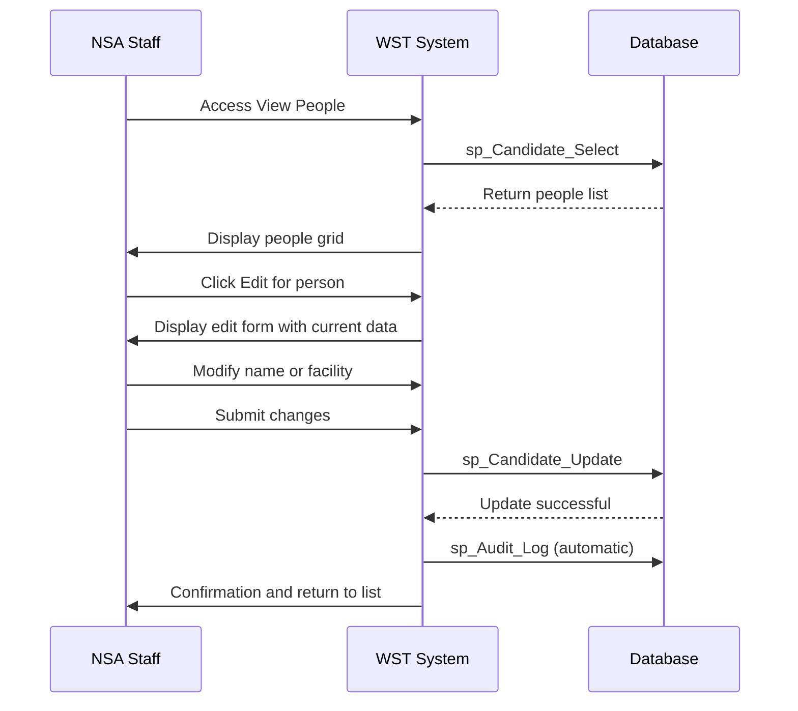
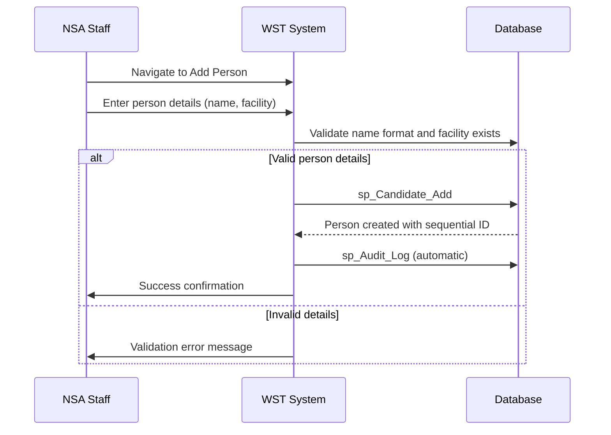

# Feature Specification: Personnel Management

**Feature ID:** FT-003  
**Title:** Personnel Management  
**Priority:** Must Have  
**Layer:** 1

## Overview

This feature manages information about individuals who require or have received safety certifications. It provides comprehensive personnel registration, information management, and maintains the relationship between personnel and their assigned facilities for certification tracking purposes.

## User Stories

### US-008: Add New Person
**As an** NSA staff member  
**I want** to add new personnel to the system  
**So that** they can receive safety certifications

**Acceptance Criteria:**
- Person name is required in "surname, first name" format
- Facility assignment is required from available facilities
- Person ID is automatically generated sequentially
- System validates name format before creation
- Person is linked to selected facility upon creation
- Audit log entry is created for new personnel

### US-009: View Personnel List
**As an** NSA staff member  
**I want** to view all personnel in the system  
**So that** I can select individuals for certification or information updates

**Acceptance Criteria:**
- All personnel are displayed with Person ID, name, facility code, and facility name
- List supports pagination for large numbers of personnel
- Edit and delete links are available for each person (based on permissions)
- List can be filtered or searched by name or facility
- Personnel records show current facility assignment

### US-010: Edit Person Information
**As an** NSA staff member  
**I want** to update person information  
**So that** personnel records remain current when details change

**Acceptance Criteria:**
- Person name can be updated following "surname, first name" format
- Facility assignment can be changed to different facilities
- Person ID cannot be modified (system generated)
- Existing certification records remain linked to person
- Audit log entry is created for person updates
- Cannot delete persons with existing certifications

### US-011: Maintain Personnel Data Integrity
**As a** system administrator  
**I want** the system to protect personnel data integrity  
**So that** certification records remain accurate and historical data is preserved

**Acceptance Criteria:**
- Persons with certification records cannot be deleted
- Sequential Person ID generation is maintained
- Historical certification records are preserved when person details change
- Referential integrity with certifications is maintained
- Person-facility assignments are validated

## Dependencies

**Upstream:** FT-001 (Reference Data Management), FT-002 (Facility Management)  
**Downstream:** FT-005 (Certification Management)

## Business Rules

From PRD Section 5:

- **BR-004** — A person can only be registered once per facility
- **BR-005** — Person names must be entered in "surname, first name" format
- **BR-006** — Person IDs are generated sequentially by the system and should not be manually editable
- **BR-007** — A person record can only be deleted after all their associated certification records have been deleted first
- **BR-008** — People should not be deleted from the system even if they leave facilities, to maintain historical certification records for safety incident queries

## Actors

From PRD Section 2:
- **NSA Staff** — Process certification notifications and maintain personnel records
- **Facility Staff** — Personnel who require safety certification (subjects of records)
- **Superuser** — Full access to all functions
- **Data Entry User** — Can add, edit, delete person records
- **Read Only User** — View-only access to person data

## Entities

### Person (from PRD Section 3.3)
| Property | Type | Required | Constraints |
|----------|------|----------|-------------|
| Candidate_No | integer | yes | Auto-generated sequential ID |
| CandidateName | string | yes | "surname, first name" format |
| Facility_Code | string | yes | Foreign key to Facility |

## Key Interfaces

### Add Person (from PRD Section 4)
- **Purpose:** Form for adding new candidates to the system
- **URL/route pattern:** WSTHome.aspx (view 1)
- **Key fields:** Name (surname, first name format) - required, Facility dropdown - required
- **Key actions:** Add Person button, Clear button
- **Navigation:** Person > Add a person
- **Workflows:** Record New Certification, Personnel Registration

### View People (from PRD Section 4)
- **Purpose:** Lists all candidates in the system with basic details
- **URL/route pattern:** WSTHome.aspx (view 3)
- **Key fields:** PersonID, Person name, PlantNo (facility code), facility Name
- **Key actions:** Edit link, Delete link for each person, pagination controls
- **Navigation:** Person > View people
- **Workflows:** Record New Certification, Update Person Information, View Certification History

### Edit Person (from PRD Section 4)
- **Purpose:** Allows modification of existing person records
- **URL/route pattern:** WSTHome.aspx (view 4)
- **Key fields:** Person ID (auto-generated), Name, Facility selection
- **Key actions:** Update person, Cancel/back to list
- **Navigation:** Via Edit link from View People screen
- **Workflows:** Update Person Information

## Workflows

From PRD Section 6:

### Update Person Information


### Add New Person (part of Record New Certification workflow)


## Behaviour

From PRD Section 9:

```gherkin
Scenario: Add new person with valid details
  Given a facility exists in the system
  When I enter a person name in "surname, firstname" format
  And I select a valid facility
  Then the person is created with a sequential Person ID
  And the person is assigned to the selected facility

Scenario: Prevent person deletion with certifications
  Given a person has certification records
  When I attempt to delete the person
  Then the system displays an error message
  And the person record is not deleted

Scenario: Update person facility assignment
  Given a person exists in the system
  When I change their facility assignment
  Then the person's facility is updated
  And existing certifications remain linked to the person
```

## Security & Access Control

From PRD Section 10:
- **Superuser (Level 1):** Full personnel management access
- **Data Entry (Level 2):** Can add, edit, delete person records
- **Read Only (Level 3):** View-only access to person data

## Success Criteria

- New personnel can be added with proper name formatting and facility assignment
- Personnel lists provide efficient navigation and selection capabilities
- Person information can be updated while preserving certification history
- Sequential ID generation maintains data integrity
- Deletion protection prevents loss of historical certification data
- Person-facility relationships are properly maintained

## Known Limitations

From PRD Section 15:
- **Manual duplicate checking:** Users must manually verify that people don't already exist before adding new records due to lack of automated duplicate validation
- **Frontend edit limitations:** Some person management functions may be restricted in the user interface

## Data Migration Considerations

From PRD Section 16:
- **Sequential ID preservation:** Person IDs are auto-generated sequentially and must be preserved during migration to maintain referential integrity with certification records

## Open Questions

- Should the system provide automated duplicate detection for similar names?
- What is the business process for handling personnel transfers between facilities?
- How should the system handle name changes (marriage, legal name changes)?
- Should there be validation for common name format errors?
- What happens to person records when facilities are closed or merged?