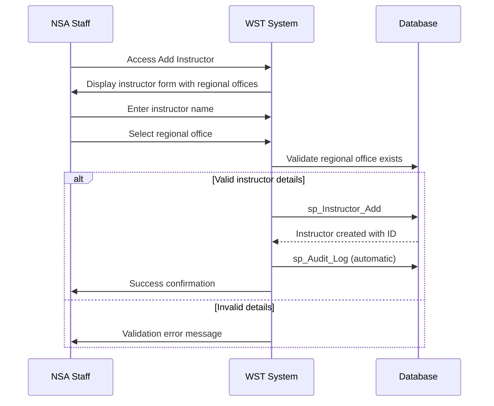
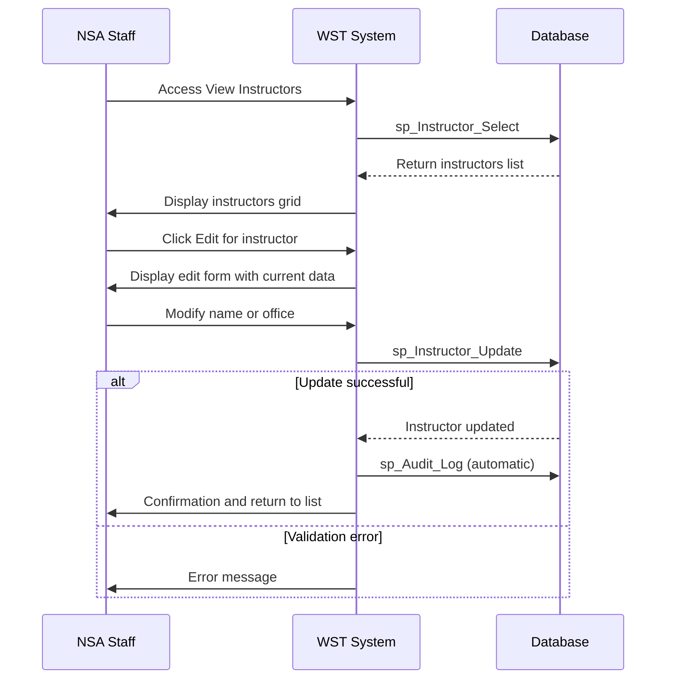
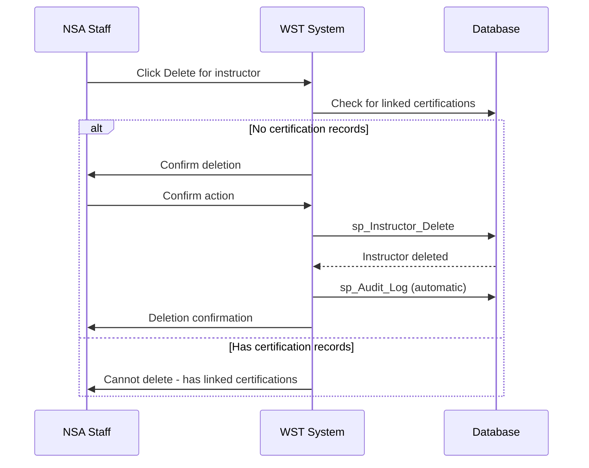

# Feature Specification: Instructor Management

**Feature ID:** FT-004  
**Title:** Instructor Management  
**Priority:** Must Have  
**Layer:** 1

## Overview

This feature manages the instructors who provide certifications and their association with regional offices. Instructors can be either NSA staff or previously certified facility personnel qualified to provide safety training certifications to candidates.

## User Stories

### US-012: Add New Instructor
**As an** NSA staff member  
**I want** to add new instructors to the system  
**So that** they can provide certifications to personnel

**Acceptance Criteria:**
- Instructor name is required
- Regional office assignment is required from available offices
- Instructor ID is automatically generated
- System validates regional office exists
- Instructor is linked to selected regional office upon creation
- Audit log entry is created for new instructors

### US-013: View Instructor List
**As an** NSA staff member  
**I want** to view all instructors in the system  
**So that** I can select instructors for certification assignments

**Acceptance Criteria:**
- All instructors are displayed with ID, name, and regional office
- List supports pagination for large numbers of instructors
- Edit and delete links are available (based on permissions and constraints)
- Regional office information is clearly displayed
- List can be filtered by regional office

### US-014: Edit Instructor Information
**As an** NSA staff member  
**I want** to update instructor information  
**So that** instructor records remain current

**Acceptance Criteria:**
- Instructor name can be updated
- Regional office assignment can be changed
- Instructor ID cannot be modified (system generated)
- Existing certification records remain linked to instructor
- Audit log entry is created for instructor updates
- Cannot delete instructors with existing certification records

### US-015: Maintain Instructor Data Integrity
**As a** system administrator  
**I want** the system to protect instructor data integrity  
**So that** certification authority remains traceable

**Acceptance Criteria:**
- Instructors with certification records cannot be deleted
- Regional office assignments are validated
- Historical certification records preserve instructor information
- Referential integrity with certifications is maintained

## Dependencies

**Upstream:** FT-001 (Reference Data Management)  
**Downstream:** FT-005 (Certification Management)

## Business Rules

From PRD Section 5:

- **BR-012** — An instructor must be linked to a regional office
- **BR-013** — An instructor cannot be deleted if they have certification records linked to them
- **BR-002** — A candidate cannot be certified by themselves - the candidate and instructor must be different people

## Actors

From PRD Section 2:
- **NSA Staff** — Manage instructor records and assignments
- **Certified Instructors** — Qualified personnel who provide safety certifications
- **Regional Office Staff** — NSA employees who may serve as instructors
- **Superuser** — Full access to all functions
- **Data Entry User** — Can add, edit, delete instructor records

## Entities

### Instructor (from PRD Section 3.3)
| Property | Type | Required | Constraints |
|----------|------|----------|-------------|
| Instructor_ID | integer | yes | Primary key identifier |
| InstructorName | string | yes | Instructor's full name |
| Office_ID | integer | yes | Foreign key to RegionalOffice |

### Regional Office (from FT-001)
| Property | Type | Required | Constraints |
|----------|------|----------|-------------|
| Office_ID | integer | yes | Primary key, numeric values only |
| Office_Name | string | yes | Office display name |

## Key Interfaces

### Add Instructor (from PRD Section 4)
- **Purpose:** Form for adding new instructors to the system
- **URL/route pattern:** WSTHome.aspx (view 5)
- **Key fields:** Instructor Name (required), Regional Office dropdown (required)
- **Key actions:** Add Instructor button, Clear button
- **Navigation:** Separate from person management due to different requirements
- **Workflows:** Manage Instructors

## Workflows

### Add New Instructor


### Update Instructor Information


### Delete Instructor (with constraints)


## Behaviour

```gherkin
Scenario: Add instructor with valid details
  Given regional offices exist in the system
  When I enter an instructor name
  And I select a valid regional office
  Then the instructor is created with a system-generated ID
  And the instructor is linked to the selected office

Scenario: Prevent instructor deletion with certifications
  Given an instructor has provided certifications
  When I attempt to delete the instructor
  Then the system displays an error message
  And the instructor record is not deleted

Scenario: Update instructor regional office
  Given an instructor exists in the system
  When I change their regional office assignment
  Then the instructor's office is updated
  And existing certification records remain linked to the instructor

Scenario: Prevent self-certification assignment
  Given a person exists as both candidate and instructor
  When I attempt to assign the person as instructor for their own certification
  Then the system should prevent this assignment
```

## Security & Access Control

From PRD Section 10:
- **Superuser (Level 1):** Full instructor management access
- **Data Entry (Level 2):** Can add, edit, delete instructor records
- **Read Only (Level 3):** View-only access to instructor data

## Success Criteria

- New instructors can be added with proper regional office assignments
- Instructor lists support efficient selection for certification workflows
- Instructor information can be updated while preserving certification history
- Deletion protection prevents loss of certification authority tracking
- Regional office assignments are properly validated and maintained
- Self-certification scenarios are prevented through validation

## Integration Points

- **Regional Office Data:** Depends on reference data from FT-001
- **Certification Assignment:** Provides instructor data for FT-005
- **Audit Logging:** All instructor operations are audited

## Data Quality

- Instructor names should follow consistent formatting
- Regional office assignments must be valid references
- Historical integrity must be maintained for compliance

## Open Questions

- Should there be validation for instructor qualifications or certifications?
- How should the system handle instructor transfers between regional offices?
- Are there specific formatting requirements for instructor names?
- Should the system track instructor certification expiry dates?
- How should retired or inactive instructors be handled?