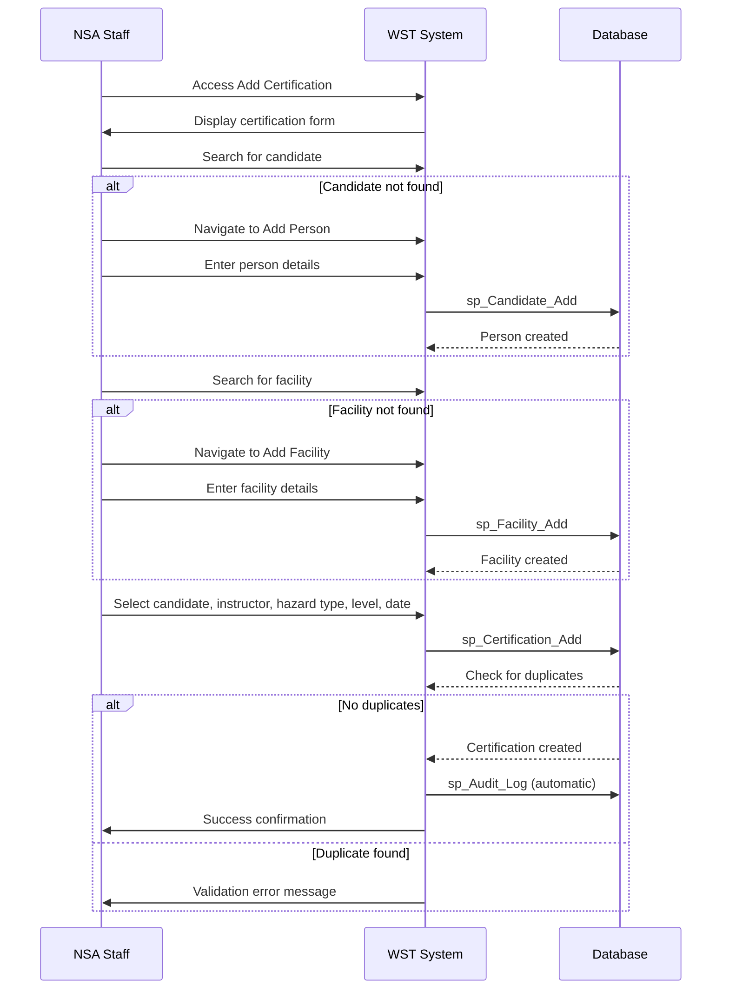
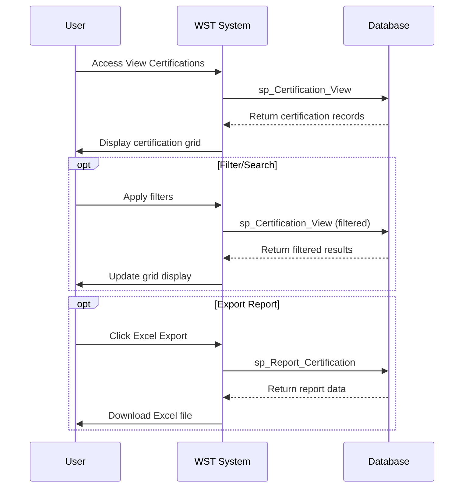

# Feature Specification: Certification Management

**Feature ID:** FT-005  
**Title:** Certification Management  
**Priority:** Must Have  
**Layer:** 2

## Overview

This feature manages the core process of recording and maintaining certification records for personnel handling hazardous materials. It serves as the central hub for processing notification forms from facilities and maintaining comprehensive safety training records that ensure regulatory compliance.

## User Stories

### US-016: Record New Certification
**As an** NSA staff member  
**I want** to record new safety certifications  
**So that** personnel training compliance is properly documented

**Acceptance Criteria:**
- Candidate selection is required from existing personnel
- Instructor selection is required from existing instructors
- Hazard type selection from Chemical, Electrical, Mechanical
- Certification level selection from Peer-Certified, Certified, Recertified
- Date is required in DD/MM/YYYY format
- System prevents duplicate certifications for same person and hazard type
- System prevents self-certification (candidate = instructor)
- Audit log entry is created for all certifications

### US-017: View Certification Records
**As an** NSA staff member or authorised user  
**I want** to view certification records  
**So that** I can verify training status for compliance and incident investigation

**Acceptance Criteria:**
- All certifications displayed with candidate, instructor, hazard type, level, and date
- List supports pagination for large record sets
- Edit and delete functions available (based on permissions)
- Records can be filtered by candidate, instructor, hazard type, or date range
- Certification history is maintained chronologically

### US-018: Update Certification Information
**As an** NSA staff member  
**I want** to update certification records  
**So that** corrections can be made when errors are identified

**Acceptance Criteria:**
- All certification fields can be modified
- Date validation ensures proper DD/MM/YYYY format
- System maintains duplicate checking on updates
- Self-certification validation applies to updates
- Audit log entry records all changes
- Original certification data is preserved in audit trail

### US-019: Delete Certification Records
**As an** NSA staff member with appropriate permissions  
**I want** to delete invalid certification records  
**So that** the system maintains accurate data

**Acceptance Criteria:**
- Delete function is available based on user permissions
- Confirmation prompt prevents accidental deletions
- Audit log records deletion with user and timestamp
- Historical audit data preserves deleted record information

### US-020: Handle Missing Prerequisites
**As an** NSA staff member  
**I want** to create missing personnel or facility records during certification  
**So that** notification forms can be processed efficiently without workflow interruption

**Acceptance Criteria:**
- System provides navigation to Add Person when candidate not found
- System provides navigation to Add Facility when facility not found
- New person/facility records are immediately available for certification
- Workflow can resume seamlessly after creating prerequisites
- All operations maintain audit trail

## Dependencies

**Upstream:** FT-002 (Facility Management), FT-003 (Personnel Management), FT-004 (Instructor Management)  
**Downstream:** FT-007 (Audit and Compliance), FT-008 (Navigation and Dashboard), FT-009 (Reporting and Analytics)

## Business Rules

From PRD Section 5:

- **BR-001** — A candidate cannot have duplicate certifications for the same hazard type
- **BR-002** — A candidate cannot be certified by themselves - the candidate and instructor must be different people
- **BR-003** — Currently only one type of certification level can be assigned to a person for a given hazard type, leading to the creation of "Recertified" as a workaround
- **BR-018** — Certification dates must be valid dates in DD/MM/YYYY format
- **BR-020** — All write operations except excluded procedures must be logged

## Actors

From PRD Section 2:
- **NSA Staff** — Primary users who process certification notifications
- **Regional Office Staff** — May have access to view regional certification data
- **Certified Instructors** — Appear as certification providers in records
- **Facility Staff** — Appear as certification candidates in records
- **Superuser** — Full access to all certification functions
- **Data Entry User** — Can add, edit, delete certification records
- **Read Only User** — View-only access to certification data

## Entities

### Certification (from PRD Section 3.3)
| Property | Type | Required | Constraints |
|----------|------|----------|-------------|
| Candidate_No | integer | yes | Foreign key to Person |
| Instructor_ID | integer | yes | Foreign key to Instructor |
| Date_Certified | date | yes | DD/MM/YYYY format |
| Hazard_Type | enum(Chemical,Electrical,Mechanical) | yes | Type of hazard certification |
| CertLevel | enum(Peer-Certified,Certified,Recertified) | yes | Level of certification |

## Key Interfaces

### Add Certification (from PRD Section 4)
- **Purpose:** Form for recording new certification events
- **URL/route pattern:** WSTHome.aspx (view 9)
- **Key fields:** Candidate dropdown (required), Instructor dropdown (required), Hazard Type dropdown (required), Certification Level dropdown (required), Date (required)
- **Key actions:** Add Certification button, Clear button
- **Navigation:** Certification > Add certification
- **Workflows:** Record New Certification

### View Certifications (from PRD Section 4)
- **Purpose:** Lists all certification records in the system
- **URL/route pattern:** WSTHome.aspx (view 11)
- **Key fields:** ID, Candidate, Instructor, Hazard Type, Level, Date
- **Key actions:** Edit certification, Delete certification, pagination
- **Navigation:** Certification > View/alter/delete certification
- **Workflows:** View Certification History

## Workflows

From PRD Section 6:

### Record New Certification


### View Certification History


## Behaviour

From PRD Section 9:

```gherkin
Scenario: Record valid certification
  Given a person exists in the system
  And an instructor exists in the system
  And the person has no existing certification for the selected hazard type
  When I add a certification with candidate, instructor, hazard type, level, and valid date
  Then the certification is saved
  And an audit log entry is created

Scenario: Prevent duplicate certification
  Given a person has an existing certification for Chemical hazard type
  When I attempt to add another Chemical certification for the same person
  Then the system displays a validation error
  And no certification record is created

Scenario: Prevent self-certification
  Given a person exists as both candidate and instructor
  When I attempt to assign the person as instructor for their own certification
  Then the system should prevent this assignment
```

## Security & Access Control

From PRD Section 10:
- **Superuser (Level 1):** Full certification management access
- **Data Entry (Level 2):** Can add, edit, delete certification records
- **Read Only (Level 3):** View-only access, cannot modify certifications

## Success Criteria

- Notification forms can be processed efficiently with complete data validation
- Duplicate certifications are prevented while allowing legitimate recertification
- Self-certification scenarios are blocked through system validation
- Certification history provides comprehensive audit trail for compliance
- Missing prerequisites can be created without interrupting workflow
- All certification operations are properly audited and logged

## Known Limitations

From PRD Section 15:
- **Multiple certification limitation:** The system cannot assign multiple certification types to one person for a given hazard type, leading to the creation of "Recertified" status as a workaround for refresher training
- **Self-certification allowed:** The system does not prevent a candidate and instructor from being the same person during certification entry
- **Validation gaps:** System allows multiple certifications on the same day without validation

## Data Migration Considerations

From PRD Section 16:
- **Audit log preservation:** Historical audit trails must be preserved for regulatory compliance
- All existing certification records must maintain referential integrity with personnel and instructor data

## Integration Points

- **Personnel Data:** Requires valid person records from FT-003
- **Instructor Data:** Requires valid instructor records from FT-004
- **Facility Data:** May require facility records from FT-002 for new personnel
- **Audit System:** All operations logged through FT-007
- **Reporting:** Certification data feeds into FT-009

## Open Questions

- How should the system handle certification renewals vs. new certifications?
- Should there be automatic expiry tracking for certifications?
- Are there specific business rules for Electrical/Mechanical combined certifications?
- What validation should exist for certification dates (future dates, reasonable past dates)?
- How should bulk certification imports be handled?