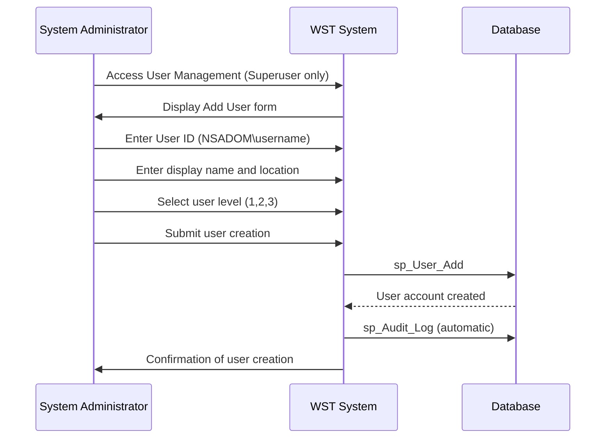
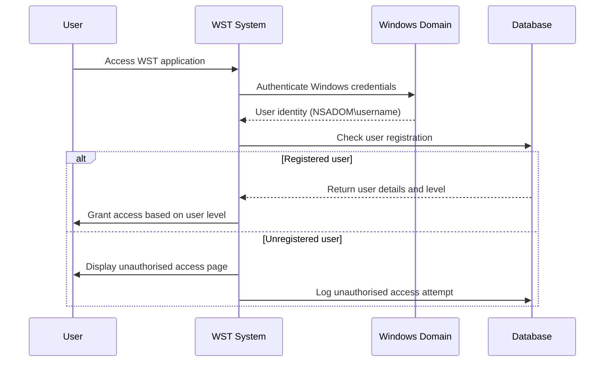
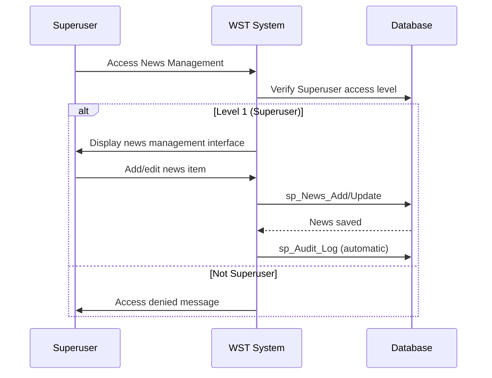

# Feature Specification: User Administration

**Feature ID:** FT-006  
**Title:** User Administration  
**Priority:** Must Have  
**Layer:** 3

## Overview

This feature manages system users and their access levels to the WST application. It provides comprehensive user account management with Windows domain integration and role-based access control to ensure appropriate security and function access across the organisation.

## User Stories

### US-021: Add New System User
**As a** system administrator with Superuser access  
**I want** to add new user accounts  
**So that** team members can access the WST system with appropriate permissions

**Acceptance Criteria:**
- User ID is required in Windows domain format (NSADOM\username)
- User display name is required
- User location (regional office) can be specified
- User level selection from 1 (Superuser), 2 (Data Entry), 3 (Read Only)
- System validates Windows domain format
- Only Superusers can create user accounts
- Audit log entry is created for user creation

### US-022: Manage User Access Levels
**As a** system administrator  
**I want** to update user access levels  
**So that** permissions can be adjusted when roles change

**Acceptance Criteria:**
- User level can be changed between 1, 2, and 3
- User name and location can be updated
- User ID cannot be changed once created
- Changes take effect immediately for security
- Only Superusers can modify user accounts
- Audit log captures all user modifications

### US-023: Control Feature Access by Role
**As a** system administrator  
**I want** users to have role-appropriate access to features  
**So that** system security and data integrity are maintained

**Acceptance Criteria:**
- Superusers have access to all system functions
- Data Entry users can manage data but not users or news
- Read Only users have view-only access to all data
- Unauthorised access attempts are blocked and logged
- Role restrictions are enforced at UI and data levels

### US-024: Integrate with Windows Authentication
**As a** system administrator  
**I want** seamless Windows domain authentication  
**So that** users can access the system with their existing credentials

**Acceptance Criteria:**
- Windows Authentication is used for all user logins
- Only registered users in WST database can access system
- Unregistered domain users receive unauthorised access message
- User identity is captured for all audit logging
- Session management integrates with Windows Authentication

## Dependencies

**Upstream:** None  
**Downstream:** FT-008 (Navigation and Dashboard)

## Business Rules

From PRD Section 5:

- **BR-014** — All users must authenticate via Windows domain accounts
- **BR-015** — Only registered users in the database can access the system
- **BR-016** — User IDs must follow domain format (default NSADOM\)
- **BR-017** — Role-Based Function Access: Superusers only can manage users and news; Data entry excluded from some views

## Actors

From PRD Section 2:
- **System Administrators** — Personnel responsible for managing user accounts and system access
- **Superuser** — System users with full access to all functions including user management
- **Data Entry User** — Users who can add, edit, delete records but cannot manage users
- **Read Only User** — Users with view-only access to all data

## Entities

### User (from PRD Section 3.3)
| Property | Type | Required | Constraints |
|----------|------|----------|-------------|
| UserID | string | yes | Windows domain format (NSADOM\username) |
| UserName | string | yes | Display name |
| User_Office | integer | no | Associated regional office |
| UserLevel | enum(1,2,3) | yes | 1=Superuser, 2=Data entry, 3=Read only |

### News (from PRD Section 3.3)
| Property | Type | Required | Constraints |
|----------|------|----------|-------------|
| Title | string | yes | News headline |
| NewsContent | string | yes | News article body |
| DatePublished | datetime | yes | Publication timestamp |
| Author | string | no | News author |

## Key Interfaces

### Add User (from PRD Section 4)
- **Purpose:** Form for adding new system users
- **URL/route pattern:** WSTHome.aspx (view 17)
- **Key fields:** User ID (Windows domain format), User name, User location, User level (role)
- **Key actions:** Add User button, Clear button
- **Navigation:** User > Add user
- **Workflows:** Add New System User

## Workflows

From PRD Section 6:

### Add New System User


### User Authentication and Access Control


### Manage News (Superuser only)


## Behaviour

From PRD Section 9:

```gherkin
Scenario: Superuser accesses all functions
  Given I am logged in as a Superuser (Level 1)
  When I navigate to any screen
  Then all functions are enabled
  And I can manage users and news

Scenario: Data entry user restricted access
  Given I am logged in as Data entry user (Level 2)
  When I navigate to user management
  Then I am denied access
  And I see an unauthorised access message

Scenario: Read-only user cannot modify data
  Given I am logged in as Read Only user (Level 3)
  When I view any data screen
  Then all input controls are disabled
  And I can only view and export data
```

## Security & Access Control

From PRD Sections 10 & 11:

### Roles & Permissions
| Role | Description | Permissions |
|------|-------------|-------------|
| Superuser (Level 1) | Full system administrator | All CRUD operations, user management, news management, all system functions |
| Data Entry (Level 2) | Operational users | Add/edit/delete persons, instructors, facilities, certifications; view all data; generate reports; cannot manage users or news |
| Read Only (Level 3) | View-only access | View all data, generate reports; all input controls disabled |

### Security Constraints
- Users must authenticate via Windows domain accounts before accessing any screen
- Only users registered in the WST database can access the system
- Session management is handled through ASP.NET with Windows Authentication integration
- Role-based access control prevents users from accessing functions above their permission level
- Unauthorised access attempts are blocked and logged

## Success Criteria

- New user accounts can be created with proper Windows domain integration
- User access levels properly restrict functionality based on role
- Windows Authentication seamlessly integrates with system security
- Unauthorised access attempts are properly blocked and logged
- News management is restricted to Superuser access only
- All user administration operations are properly audited

## Integration Points

- **Windows Domain (NSADOM):** User authentication and identity management
- **Audit System:** All user operations logged for compliance
- **Regional Offices:** User location assignments from reference data

## Data Migration Considerations

From PRD Section 16:
- **User account mapping:** Windows domain authentication integration requires mapping existing NSADOM\ user accounts to new system roles

## Open Questions

- How should disabled or departed user accounts be handled?
- Are there specific requirements for password policies (handled by domain)?
- Should there be automatic user account expiry or review processes?
- How should temporary or contractor access be managed?
- Are there specific audit requirements for user access logging?
- Should user location be mandatory for regional access control?