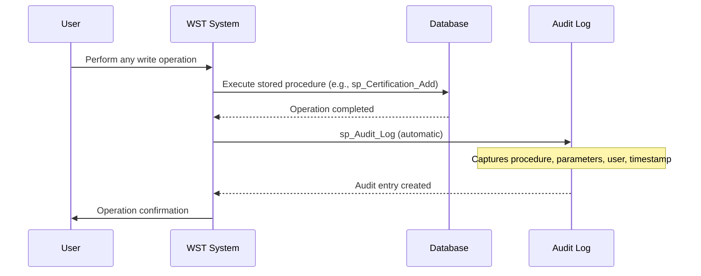
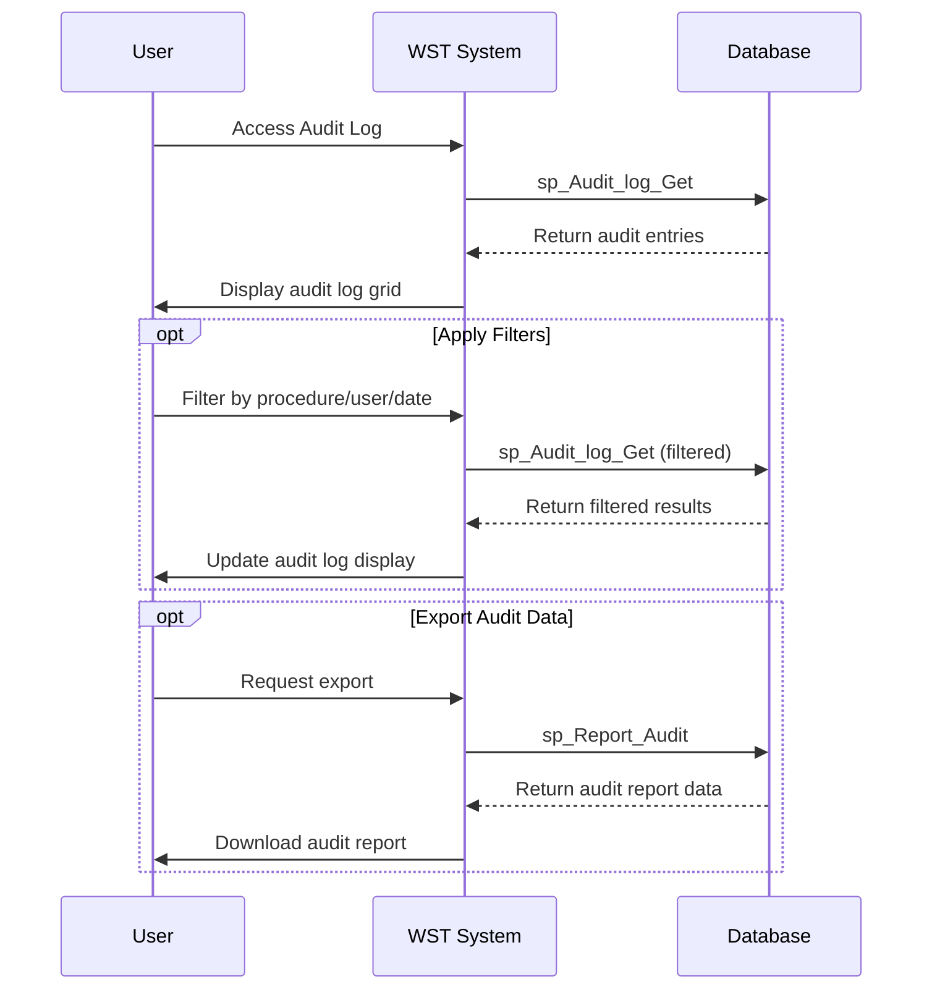
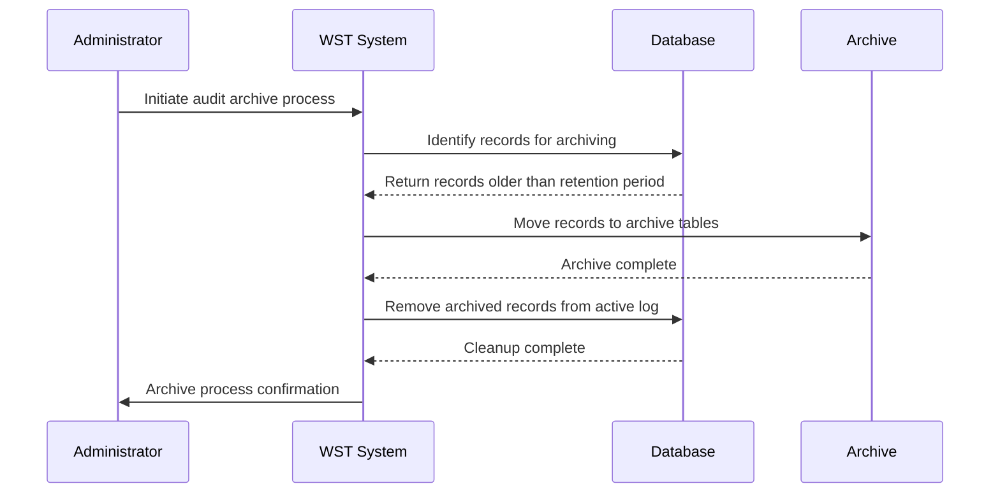

# Feature Specification: Audit and Compliance

**Feature ID:** FT-007  
**Title:** Audit and Compliance  
**Priority:** Must Have  
**Layer:** 3

## Overview

This feature provides comprehensive audit logging and compliance reporting capabilities essential for regulatory requirements and incident investigations. It captures detailed system activity, maintains historical records, and provides investigation tools for safety compliance officers.

## User Stories

### US-025: Automatic Audit Logging
**As a** compliance officer  
**I want** all system operations to be automatically logged  
**So that** complete audit trails are maintained for regulatory requirements

**Acceptance Criteria:**
- All write operations (create, update, delete) are automatically logged
- Log entries capture stored procedure name, parameters, user identity, and timestamp
- Logging occurs transparently without user intervention
- Log entries cannot be modified or deleted by users
- System performance is not significantly impacted by logging
- Excluded procedures are properly documented and justified

### US-026: View Audit Log
**As a** compliance officer or system administrator  
**I want** to view audit log entries  
**So that** I can investigate system activity and ensure compliance

**Acceptance Criteria:**
- Audit log displays ID, stored procedure, parameters, user, and date/time
- Log entries are displayed in chronological order
- Filter capabilities by stored procedure, user, and date range
- Pagination supports large audit datasets
- All users can view audit logs based on their access level
- Export functionality for external audit requirements

### US-027: Archive Audit Records
**As a** system administrator  
**I want** to archive old audit records  
**So that** long-term compliance requirements are met while maintaining system performance

**Acceptance Criteria:**
- Historical audit records are preserved in archive tables
- Archive functionality maintains data integrity and accessibility
- Archived records remain searchable for compliance investigations
- Archive process does not impact system availability
- Retention periods comply with regulatory requirements

### US-028: Compliance Reporting
**As a** compliance officer  
**I want** to generate audit reports for regulatory requirements  
**So that** compliance evidence can be provided to authorities

**Acceptance Criteria:**
- Audit data can be exported in required formats
- Reports can be filtered by date ranges, users, and operations
- Report generation preserves data integrity and completeness
- Export formats support external audit tool requirements
- Historical and current data are both accessible for reporting

## Dependencies

**Upstream:** FT-005 (Certification Management)  
**Downstream:** FT-008 (Navigation and Dashboard)

## Business Rules

From PRD Section 5:

- **BR-020** — All write operations except excluded procedures must be logged

## Actors

From PRD Section 2:
- **NSA Staff** — Generate audit data through normal system operations
- **System Administrators** — Manage audit system and archives
- **Superuser** — Full access to audit management functions
- **Data Entry User** — Generate audit data, can view audit logs
- **Read Only User** — Can view audit logs within their access level

## Entities

### Audit Log Entry
| Property | Type | Required | Description |
|----------|------|----------|-------------|
| ID | integer | yes | Unique identifier for log entry |
| Stored_Procedure | string | yes | Name of procedure executed |
| Parameters | string | yes | Procedure parameters |
| User | string | yes | Windows domain user identity |
| Date_Time | datetime | yes | Timestamp of operation |

## Key Interfaces

### Audit Log (from PRD Section 4)
- **Purpose:** Shows detailed system activity and changes for compliance
- **URL/route pattern:** Auditlog.aspx
- **Key fields:** ID, Stored Procedure, Parameters, User, Date/time
- **Key actions:** Filter by procedure, user, or date range
- **Navigation:** Separate administrative function
- **Workflows:** System audit and compliance reporting

### Audit Log Archive (from PRD Section 8)
- **Purpose:** Display archived audit records for historical compliance reporting
- **Key fields:** Same as main audit log
- **Key actions:** Filter and search archived records
- **Output format:** HTML GridView

## Workflows

### Automatic Audit Logging (Cross-cutting)


### View and Filter Audit Log


### Archive Audit Records


## Behaviour

```gherkin
Scenario: Automatic audit logging on certification creation
  Given I am adding a new certification
  When the certification is successfully saved
  Then an audit log entry is automatically created
  And the entry captures the stored procedure, parameters, my user ID, and timestamp

Scenario: Filter audit log by user
  Given audit log entries exist for multiple users
  When I filter the audit log by a specific user
  Then only entries for that user are displayed
  And the filter can be combined with date ranges

Scenario: Archive old audit records
  Given audit records older than the retention period exist
  When the archive process is executed
  Then old records are moved to archive tables
  And they remain accessible for compliance queries
  And active log performance is maintained

Scenario: Export audit data for compliance
  Given audit log entries exist
  When I export audit data for a date range
  Then all relevant entries are included in the export
  And the export format supports external audit tools
```

## Security & Access Control

From PRD Section 11:
- All database write operations are automatically logged with user identity, timestamp, and operation details for audit compliance
- Unauthorised access attempts are blocked and logged

### Access Levels
- **All Users:** Can view audit logs within their data access scope
- **Superusers:** Full audit management and archive access
- **Data Entry Users:** Can view audit logs, generate reports
- **Read Only Users:** Can view audit logs, generate reports

## Success Criteria

- All write operations are captured in audit logs without exception
- Audit logs provide complete traceability for compliance investigations
- System performance remains acceptable with comprehensive logging
- Historical audit data is preserved and accessible
- Compliance reports can be generated efficiently
- Audit data integrity is maintained across the system

## Compliance Requirements

From PRD Section 11:
- Comprehensive audit logging for regulatory compliance
- Historical data preservation for safety incident investigations
- User identity tracking for all operations
- Unauthorised access attempt logging

## Integration Points

- **All Data Operations:** Cross-cutting logging for FT-002, FT-003, FT-004, FT-005
- **User Authentication:** User identity capture from FT-006
- **Reporting System:** Audit data feeds into FT-009

## Non-Functional Requirements

From PRD Section 17:
- **Audit and Logging:** All write operations must be logged with stored procedure name, parameters, user identity, and timestamp for regulatory compliance
- **Audit log archiving:** System includes audit log archival functionality indicating long-term retention requirements
- **Usage tracking:** Application includes usage statistics logging separate from audit trail

## Open Questions

- What is the specific retention period for audit records before archiving?
- Are there specific regulatory standards that must be met for audit logging?
- Should real-time alerting be implemented for suspicious activity?
- How should audit data be protected against tampering or unauthorised access?
- Are there specific export formats required for external auditors?
- Should user activity patterns be tracked beyond basic operation logging?