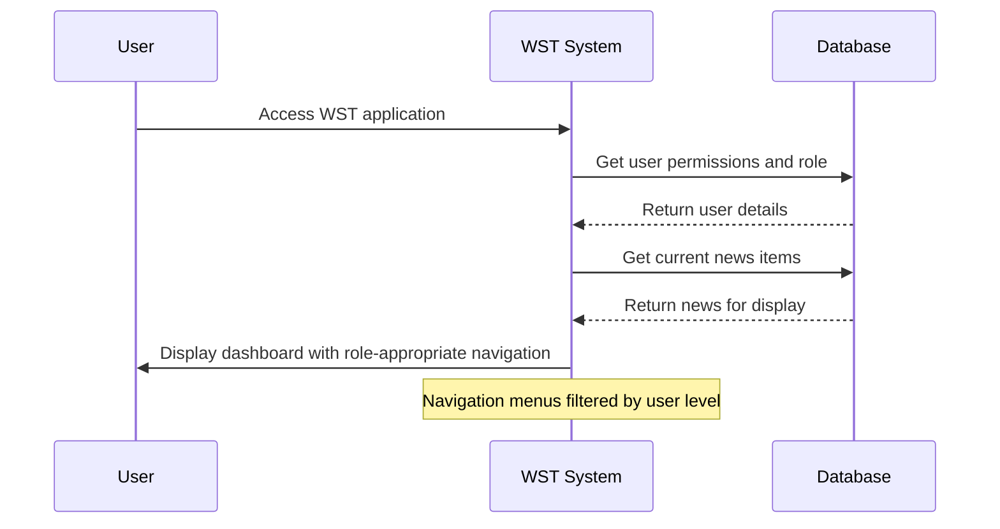
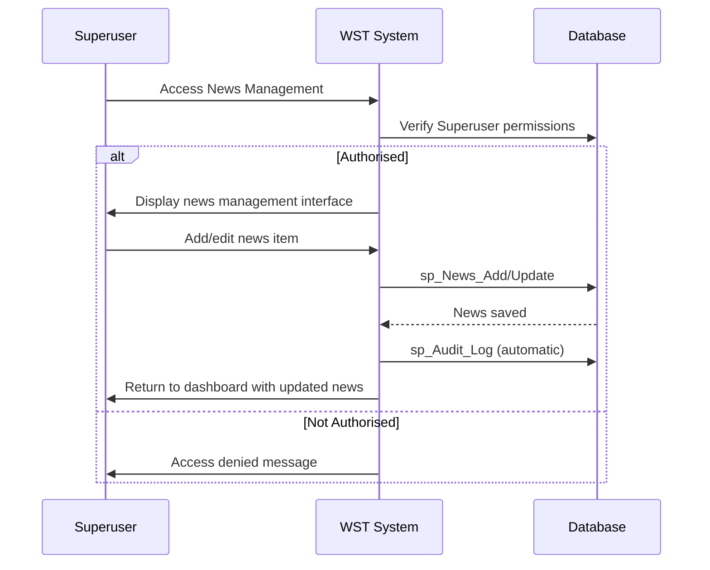
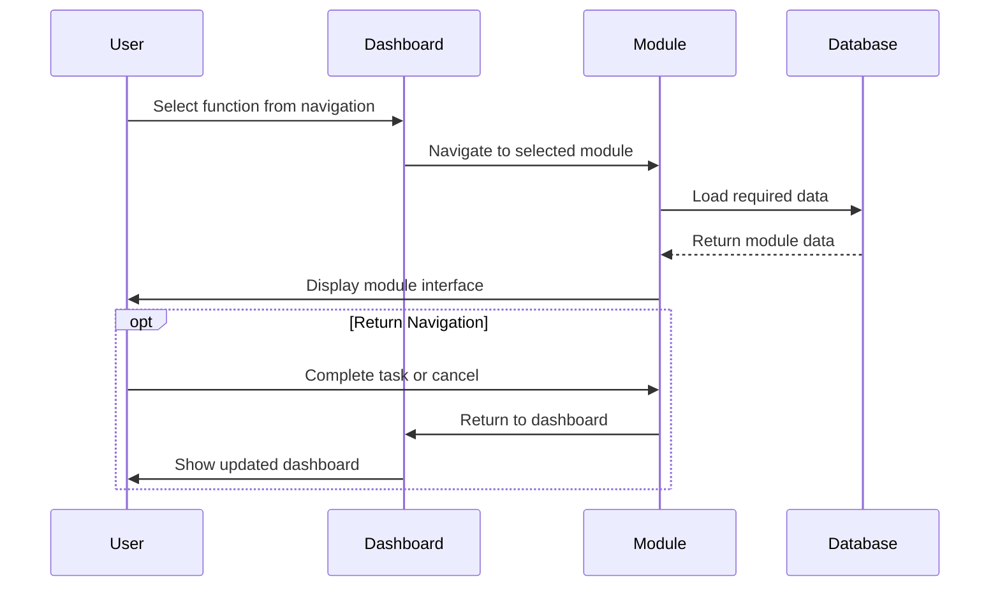

# Feature Specification: Navigation and Dashboard

**Feature ID:** FT-008  
**Title:** Navigation and Dashboard  
**Priority:** Must Have  
**Layer:** 4

## Overview

This feature provides the central navigation hub and dashboard interface for the WST system. It serves as the primary entry point for all users, displaying news updates, user information, and providing navigation access to all system functions based on user permissions.

## User Stories

### US-029: Home Dashboard Display
**As a** WST system user  
**I want** a dashboard showing relevant news and system information  
**So that** I can stay informed and efficiently navigate to required functions

**Acceptance Criteria:**
- Home page displays current user information (name, role, domain)
- News articles are displayed with publication dates
- Dashboard layout is clear and professional
- User role-appropriate navigation options are visible
- Recent system activity or alerts may be shown
- Page loads efficiently for all user types

### US-030: Role-Based Navigation
**As a** WST system user  
**I want** navigation menus appropriate to my access level  
**So that** I can access authorised functions efficiently

**Acceptance Criteria:**
- Dropdown menus provide access to Person, Certification, Facility functions
- User management functions only visible to Superusers
- News management only available to Superusers
- Help and Reports functions available to all users
- Navigation reflects current user permissions
- Unauthorised options are not displayed

### US-031: News Management for Superusers
**As a** Superuser  
**I want** to manage news items on the home page  
**So that** important system updates and announcements can be communicated

**Acceptance Criteria:**
- News items can be added with title, content, and publication date
- Existing news can be edited or removed
- Author information can be captured
- Publication dates control news display order
- Only Superusers have access to news management functions
- News content supports rich text formatting

### US-032: System Navigation and Workflow Support
**As a** WST system user  
**I want** seamless navigation between related functions  
**So that** certification workflows can be completed efficiently

**Acceptance Criteria:**
- Navigation preserves user context during multi-step workflows
- Breadcrumb or navigation history helps users track their location
- Related functions are logically grouped in navigation menus
- Return navigation from detail screens back to listing screens
- Cross-references between screens (e.g., person to certifications) work correctly

## Dependencies

**Upstream:** FT-005 (Certification Management), FT-006 (User Administration), FT-007 (Audit and Compliance)  
**Downstream:** None

## Business Rules

From PRD Section 5:
- **BR-017** — Role-Based Function Access: Superusers only can manage users and news; Data entry excluded from some views

## Actors

From PRD Section 2:
- **All WST Users** — Access the dashboard and navigation functions
- **NSA Staff** — Primary users requiring access to operational functions
- **Regional Office Staff** — May access regional data through dashboard
- **System Administrators** — Require full navigation access
- **Superuser** — Full access including news management
- **Data Entry User** — Access to operational functions but not administration
- **Read Only User** — Limited navigation to view-only functions

## Key Interfaces

### Home Page (from PRD Section 4)
- **Purpose:** Dashboard providing news updates and navigation hub for all system functions
- **URL/route pattern:** Default.aspx, WSTHome.aspx
- **Key fields:** User information display (name, role, domain), news articles with publication dates
- **Key actions:** Navigate to modules via dropdown menus (Person, Certification, Facility, User, News, Help, Reports)
- **Navigation:** Central hub linking to all other screens
- **Workflows:** All workflows start from this screen

## Navigation Structure

From PRD Section 4 analysis:

### Primary Navigation Menus
- **Person**
  - Add a person
  - View people
- **Certification**
  - Add certification
  - View/alter/delete certification
- **Facility**
  - Add facility
  - View facilities
- **User** (Superuser only)
  - Add user
  - Manage users
- **News** (Superuser only)
  - Add news
  - Manage news
- **Help**
  - System help and documentation
- **Reports**
  - Export functions

## Workflows

### User Dashboard Access


### News Management (Superuser)


### Navigation Workflow Integration


## Behaviour

```gherkin
Scenario: Dashboard displays user-appropriate navigation
  Given I am logged in as a Data Entry user
  When I access the home dashboard
  Then I see Person, Certification, Facility, Reports, and Help menus
  And I do not see User or News management options

Scenario: Superuser accesses news management
  Given I am logged in as a Superuser
  When I access the News menu
  Then I can add and edit news items
  And the news appears on all users' dashboards

Scenario: Navigation preserves workflow context
  Given I am adding a certification
  When I navigate to add a missing person
  And complete the person creation
  Then I can return to certification entry
  And the new person is available for selection

Scenario: Read-only user sees limited options
  Given I am logged in as a Read Only user
  When I access any navigation menu
  Then I see view-only options
  And all modification functions are hidden
```

## Security & Access Control

From PRD Section 10:

### Role-Based Navigation Display
| Role | Available Navigation |
|------|---------------------|
| Superuser (Level 1) | All menus including User and News management |
| Data Entry (Level 2) | Person, Certification, Facility, Reports, Help |
| Read Only (Level 3) | View-only versions of all data menus, Reports, Help |

## Success Criteria

- Dashboard provides efficient access to all authorised functions
- News system keeps users informed of important updates
- Navigation menus reflect user permissions accurately
- Workflow navigation supports efficient task completion
- User information is clearly displayed for context
- System performance supports responsive navigation

## Integration Points

- **User Management:** User role and permission data from FT-006
- **All Data Modules:** Navigation links to FT-002, FT-003, FT-004, FT-005
- **Audit System:** News management operations logged via FT-007
- **Reporting:** Links to reporting functions in FT-009

## User Experience

- Clean, professional interface appropriate for government/regulatory environment
- Consistent navigation patterns across all screens
- Clear visual hierarchy and information organisation
- Responsive design supporting different screen sizes
- Accessible design following government accessibility standards

## Open Questions

- Should the dashboard display usage statistics or system status information?
- Are there specific news content formatting or approval requirements?
- Should navigation include recently accessed functions or favourites?
- Are there specific branding or design standards that must be followed?
- Should the dashboard be customisable by individual users?
- How should system notifications or alerts be displayed on the dashboard?