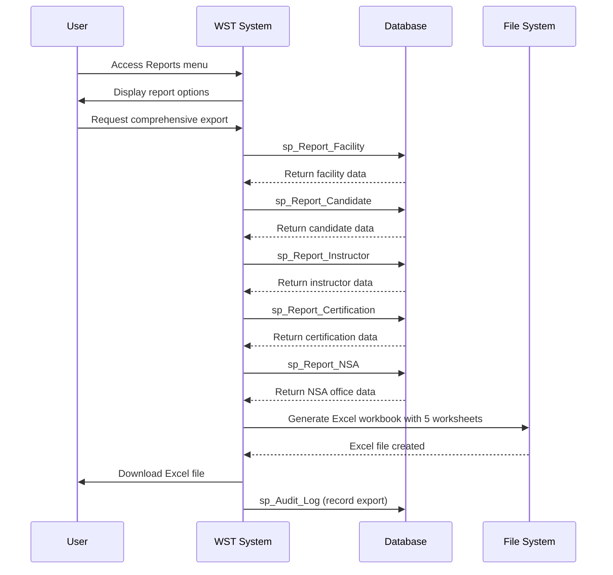
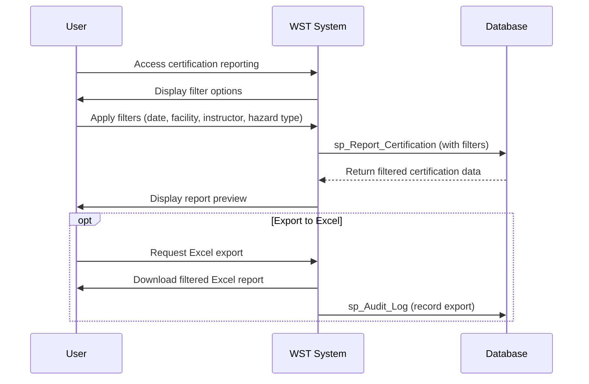
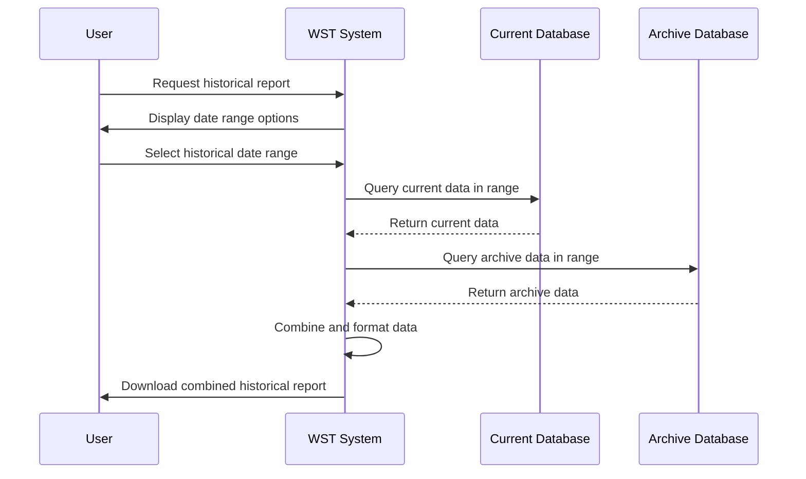

# Feature Specification: Reporting and Analytics

**Feature ID:** FT-009  
**Title:** Reporting and Analytics  
**Priority:** Should Have  
**Layer:** 4

## Overview

This feature provides comprehensive data export and reporting functionality for offline analysis, regulatory compliance, and business intelligence. It enables users to extract system data in usable formats for external analysis, backup purposes, and compliance reporting requirements.

## User Stories

### US-033: Generate Comprehensive Data Export
**As an** NSA staff member or compliance officer  
**I want** to export all system data to Excel format  
**So that** I can perform offline analysis and maintain data backups

**Acceptance Criteria:**
- Export includes all major data tables: facilities, candidates, instructors, certifications, NSA offices
- Data is exported to Excel format (.xlsx) with separate worksheets for each data type
- Export includes all fields and maintains data relationships
- Export process completes within reasonable time for large datasets
- Generated file is downloadable and usable in standard Excel applications
- Export operation is logged in audit trail

### US-034: Generate Filtered Reports
**As a** compliance officer  
**I want** to generate reports with specific filters  
**So that** I can focus on relevant data for investigations and compliance

**Acceptance Criteria:**
- Reports can be filtered by date ranges for certification data
- Facility-based filtering for regional or facility-specific reports
- Instructor-based filtering for quality assurance reviews
- Hazard type filtering for specific compliance requirements
- Multiple filter combinations are supported
- Filtered data maintains referential integrity

### US-035: Access Historical Reporting Data
**As a** compliance officer  
**I want** to generate reports including historical data  
**So that** long-term trends and compliance history can be analysed

**Acceptance Criteria:**
- Reports include data from current and archived systems
- Historical certification records are accessible for trend analysis
- Data consistency is maintained across different time periods
- Archive data is included in export functionality
- Historical context is preserved in exported data

### US-036: Support External Analysis Tools
**As a** data analyst  
**I want** exported data to be compatible with external analysis tools  
**So that** advanced analytics and reporting can be performed

**Acceptance Criteria:**
- Excel format supports pivot tables and advanced Excel functions
- Data structure enables easy import into business intelligence tools
- Column headers are descriptive and consistent
- Data types are preserved in export format
- Relationships between entities are clear in exported structure

## Dependencies

**Upstream:** FT-005 (Certification Management), FT-007 (Audit and Compliance)  
**Downstream:** None

## Business Rules

From PRD Section 8:
- Comprehensive export includes data from all major system tables
- Excel template structure must be maintained for consistency

## Actors

From PRD Section 2:
- **NSA Staff** — Generate operational reports and data exports
- **Regional Office Staff** — Access regional reporting data
- **System Administrators** — Generate system-wide reports and backups
- **Superuser** — Full access to all reporting functions
- **Data Entry User** — Can generate reports and exports
- **Read Only User** — Can generate reports and exports

## Entities

### Report Types (from PRD Section 8)

| Report | Purpose | Data Sources | Output Format |
|--------|---------|-------------|---------------|
| Comprehensive Export | Export all system data for offline analysis and backup | sp_Report_Facility, sp_Report_Candidate, sp_Report_Instructor, sp_Report_Certification, sp_Report_NSA | Excel (.xlsx) with 5 worksheets |
| Audit Log Report | Display audit trail for compliance | sp_Audit_log_Get | HTML GridView, Excel export |
| Certification Report | Filtered certification data | sp_Report_Certification | Excel format |

## Key Interfaces

### Reports (from PRD Section 4)
- **Purpose:** Provides data export functionality for offline analysis
- **URL/route pattern:** WSTHome.aspx (view 25)
- **Key fields:** Export options description
- **Key actions:** Download All Tables (Excel format)
- **Navigation:** Reports menu item
- **Workflows:** Generate Reports

## Workflows

### Generate Comprehensive Export (from PRD Section 6)


### Generate Filtered Certification Report


### Archive Data Reporting


## Behaviour

```gherkin
Scenario: Export all system data
  Given the system contains facility, personnel, instructor, and certification data
  When I request a comprehensive export
  Then an Excel file is generated with separate worksheets for each data type
  And all data relationships are preserved
  And the file is available for download

Scenario: Filter certification report by date range
  Given certification records exist across multiple months
  When I filter the certification report by a specific month
  Then only certifications from that month are included
  And the export maintains data integrity

Scenario: Export includes historical data
  Given archived certification records exist
  When I generate a report spanning historical periods
  Then both current and archived data are included
  And the timeline is accurately represented

Scenario: Large dataset export performance
  Given the system contains thousands of records
  When I request a comprehensive export
  Then the export completes within acceptable time limits
  And system performance is not significantly impacted
```

## Security & Access Control

From PRD Section 10:
- **All User Levels:** Can generate reports and exports within their data access scope
- **Data Security:** Exported data maintains same access restrictions as online system
- **Audit Trail:** All export operations are logged for compliance

## Success Criteria

- Comprehensive data exports provide complete system backup capability
- Report filtering enables focused analysis for specific requirements
- Export formats support external analysis and business intelligence tools
- Historical data is accessible and properly integrated with current data
- Export performance is acceptable for operational use
- All reporting operations are properly audited

## Integration Points

- **Certification Data:** Primary source from FT-005
- **Personnel Data:** Person records from FT-003
- **Instructor Data:** Instructor records from FT-004
- **Facility Data:** Facility records from FT-002
- **Audit Data:** Audit reports from FT-007
- **User Context:** Access control via FT-006

## Non-Functional Requirements

From PRD Section 17:
- **Performance:** Report generation timeout suggests potential for large data volumes requiring performance consideration
- **File System Integration:** Excel template access and report generation
- **Export Functionality:** Must handle large datasets efficiently

## Technical Considerations

- **Excel Template:** Located at ~/Reports/WST.xlsx, structure must be preserved
- **Data Volume:** Pagination suggests large record sets require performance optimization
- **File Generation:** Temporary file management for download capability
- **Memory Management:** Large export operations must not exhaust system resources

## Open Questions

- What are the specific retention requirements for generated reports?
- Should reports include data validation or quality indicators?
- Are there specific Excel template formatting requirements?
- Should the system support scheduled or automated report generation?
- What are the maximum dataset size limits for exports?
- Should reports include summary statistics or analytics beyond raw data?
- Are there specific regulatory report formats that must be supported?
- How should report access be controlled for different regional offices?