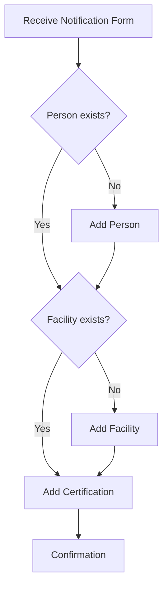
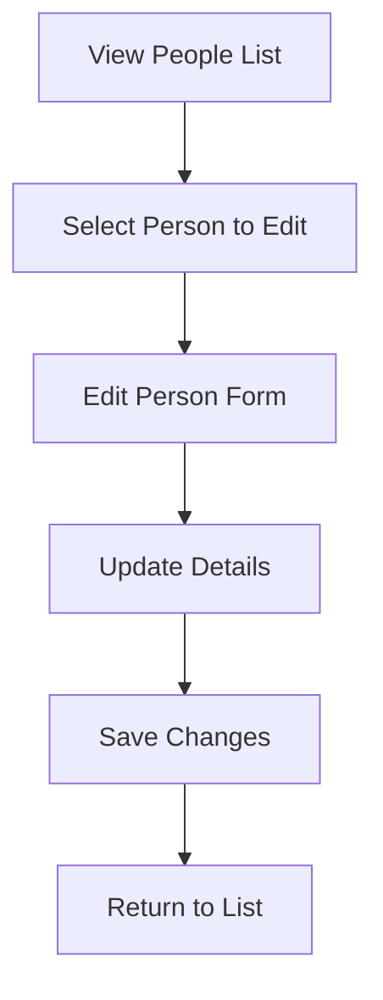
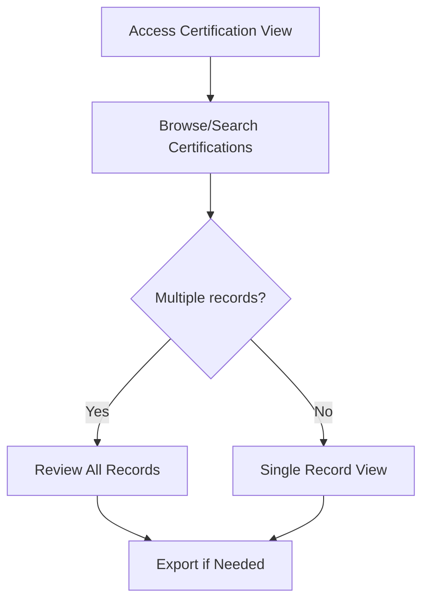
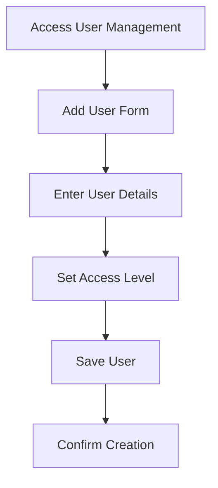
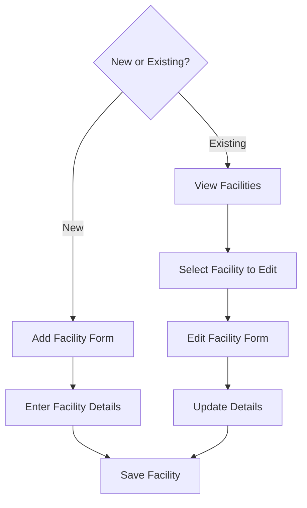
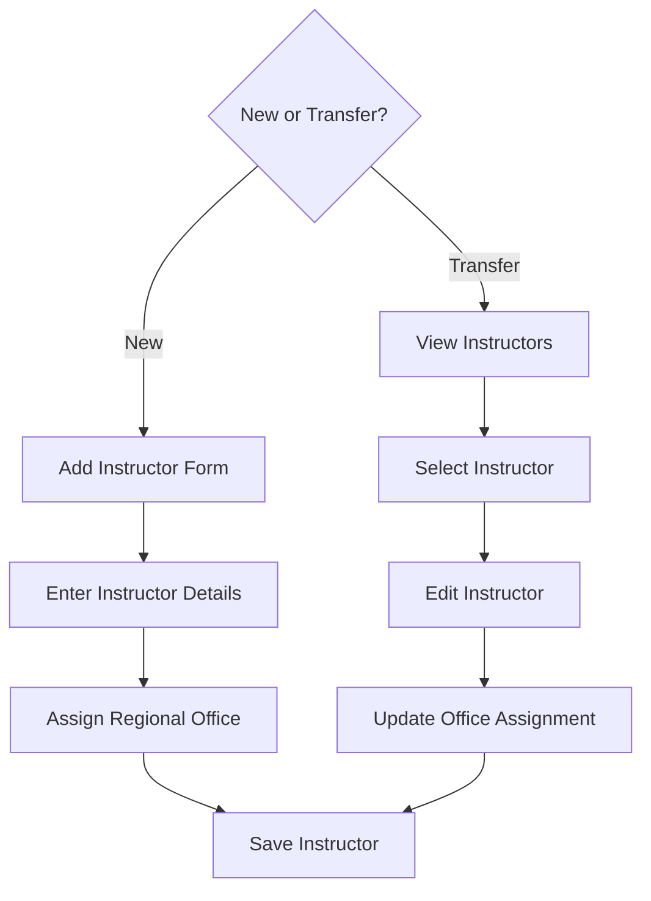
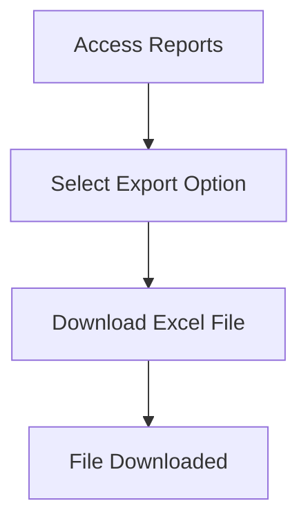

# Interaction Analysis: WST Certification Database

<!-- Input files processed:
- output/html/01_home.html
- output/html/02_home_person_dropdown.html
- output/html/03_home_certification_dropdown.html
- output/html/04_home_facility_dropdown.html
- output/html/05_home_user_dropdown.html
- output/html/06_candidate_add.html
- output/html/07_candidate_view_all.html
- output/html/08_candidate_edit.html
- output/html/09_candidate_add_validation_error.html
- output/html/10_instructor_add.html
- output/html/11_instructor_edit.html
- output/html/12_instructor_history.html
- output/html/13_facility_add.html
- output/html/14_facility_view.html
- output/html/15_facility_edit.html
- output/html/16_facility_personnel.html
- output/html/17_certification_add.html
- output/html/18_certification_view.html
- output/html/19_certification_edit.html
- output/html/20_certification_add_validation_error.html
- output/html/21_regional_office_add.html
- output/html/22_regional_office_view.html
- output/html/23_office_instructors.html
- output/html/24_user_add.html
- output/html/25_user_view.html
- output/html/26_user_edit.html
- output/html/27_news_add.html
- output/html/28_news_view.html
- output/html/29_reports.html
- output/html/30_dataentry_home.html
- output/html/31_dataentry_candidate_view.html
- output/html/32_dataentry_user_view_blocked.html
- output/html/33_readonly_home.html
- output/html/34_readonly_candidate_view.html
- output/html/35_help.html
- output/html/36_audit_log.html
- output/html/37_unauthorised_access.html
- output/html/38_file_not_found.html
- output/transcripts/wst_demo_curated.txt
-->

## 1. Screen Inventory

### Home Screen

#### Home Page
- **Purpose:** Dashboard — provides news updates and system announcements for users
- **Mockup reference:** `output/html/01_home.html`
- **Key fields:** User information display (name, role, domain), news articles with publication dates
- **Key actions:** Navigate to other modules via dropdown menus, view older news posts
- **Navigation:** Central hub linking to all other modules (Person, Certification, Facility, User, News, Help, Reports)
- **Access restrictions:** Available to all user roles
- **Transcript references:** `output/transcripts/wst_demo_curated.txt` (lines 25-29)

#### Home with Person Dropdown
- **Purpose:** Shows available person management options when user hovers over Person menu
- **Mockup reference:** `output/html/02_home_person_dropdown.html`
- **Key fields:** Same as Home page with Person menu expanded
- **Key actions:** Add a person, Edit/Delete a person, View people
- **Navigation:** Allows navigation to person management screens
- **Access restrictions:** Role-dependent access levels
- **Transcript references:** `output/transcripts/wst_demo_curated.txt` (lines 29-41)

#### Home with Certification Dropdown
- **Purpose:** Shows available certification management options when user hovers over Certification menu
- **Mockup reference:** `output/html/03_home_certification_dropdown.html`
- **Key fields:** Same as Home page with Certification menu expanded
- **Key actions:** Add certification, View/alter/delete certification, Instructor History, Instructor certified
- **Navigation:** Allows navigation to certification management screens
- **Access restrictions:** Role-dependent access levels
- **Transcript references:** `output/transcripts/wst_demo_curated.txt` (lines 117-169)

### Person Management Screens

#### Add a Person
- **Purpose:** Form for adding new candidates to the system
- **Mockup reference:** `output/html/06_candidate_add.html`
- **Key fields:** Name (Surname, First name) - required, Facility dropdown
- **Key actions:** Add Person button, Clear button
- **Navigation:** Accessed from Person > Add a person
- **Access restrictions:** Data entry and Superuser roles only
- **Transcript references:** `output/transcripts/wst_demo_curated.txt` (lines 77-82)

#### View People
- **Purpose:** Lists all candidates in the system with basic details
- **Mockup reference:** `output/html/07_candidate_view_all.html`
- **Key fields:** PersonID, Person name, PlantNo (facility code), facility Name
- **Key actions:** Edit link, Delete link for each person, pagination controls
- **Navigation:** Accessed from Person > View people
- **Access restrictions:** Available to all roles (read-only for Read Only users)
- **Transcript references:** `output/transcripts/wst_demo_curated.txt` (lines 74-76, 184-200)

#### Edit Person
- **Purpose:** Allows modification of existing person records
- **Mockup reference:** `output/html/08_candidate_edit.html`
- **Key fields:** Person ID (auto-generated), Name, Facility selection
- **Key actions:** Update person, Cancel/back to list
- **Navigation:** Accessed via Edit link from View People screen
- **Access restrictions:** Data entry and Superuser roles only
- **Transcript references:** `output/transcripts/wst_demo_curated.txt` (lines 397-470)

### Instructor Management Screens

#### Add Instructor
- **Purpose:** Form for adding new instructors to the system
- **Mockup reference:** `output/html/10_instructor_add.html`
- **Key fields:** Instructor Name (required), Regional Office dropdown
- **Key actions:** Add Instructor button, Clear button
- **Navigation:** Separate from person management due to different requirements
- **Access restrictions:** Data entry and Superuser roles only
- **Transcript references:** `output/transcripts/wst_demo_curated.txt` (lines 728-770)

#### Edit Instructor
- **Purpose:** Allows modification of existing instructor records
- **Mockup reference:** `output/html/11_instructor_edit.html`
- **Key fields:** Instructor name, Regional office assignment
- **Key actions:** Update instructor, transfer to different office
- **Navigation:** Accessed from instructor management screens
- **Access restrictions:** Data entry and Superuser roles only
- **Transcript references:** `output/transcripts/wst_demo_curated.txt` (lines 761-771)

#### Instructor History
- **Purpose:** Shows certification history for a specific instructor
- **Mockup reference:** `output/html/12_instructor_history.html`
- **Key fields:** Instructor details, list of certifications they have issued
- **Key actions:** View certification details
- **Navigation:** Accessed from Certification > Instructor History
- **Access restrictions:** Available to all roles
- **Transcript references:** `output/transcripts/wst_demo_curated.txt` (lines 680-711)

### Facility Management Screens

#### Add Facility
- **Purpose:** Form for adding new facilities to the system
- **Mockup reference:** `output/html/13_facility_add.html`
- **Key fields:** Facility Code (required), Facility Name (required), address fields, telephone, fax, NSA Office checkbox
- **Key actions:** Add Facility button, Clear button
- **Navigation:** Accessed from Facility > Add facility
- **Access restrictions:** Data entry and Superuser roles only
- **Transcript references:** `output/transcripts/wst_demo_curated.txt` (lines 84-108)

#### View Facilities
- **Purpose:** Lists all facilities in the system
- **Mockup reference:** `output/html/14_facility_view.html`
- **Key fields:** Facility code, name, NSA office indicator
- **Key actions:** Edit facility, view facility personnel
- **Navigation:** Accessed from Facility > View facilities
- **Access restrictions:** Available to all roles
- **Transcript references:** `output/transcripts/wst_demo_curated.txt` (lines 95-114)

#### Edit Facility
- **Purpose:** Allows modification of existing facility records
- **Mockup reference:** `output/html/15_facility_edit.html`
- **Key fields:** Same as Add Facility with pre-populated values
- **Key actions:** Update facility details
- **Navigation:** Accessed via Edit link from facility listing
- **Access restrictions:** Data entry and Superuser roles only
- **Transcript references:** `output/transcripts/wst_demo_curated.txt` (lines 478-492)

#### Facility Personnel
- **Purpose:** Shows all personnel certified at a specific facility
- **Mockup reference:** `output/html/16_facility_personnel.html`
- **Key fields:** Personnel list with certification details per facility
- **Key actions:** View individual certification records
- **Navigation:** Accessed from facility management screens
- **Access restrictions:** Available to all roles
- **Transcript references:** `output/transcripts/wst_demo_curated.txt` (lines 110-116)

### Certification Management Screens

#### Add Certification
- **Purpose:** Form for recording new certification events
- **Mockup reference:** `output/html/17_certification_add.html`
- **Key fields:** Candidate dropdown (required), Instructor dropdown (required), Hazard Type dropdown (required), Certification Level dropdown (required), Date (required)
- **Key actions:** Add Certification button, Clear button
- **Navigation:** Accessed from Certification > Add certification
- **Access restrictions:** Data entry and Superuser roles only
- **Transcript references:** `output/transcripts/wst_demo_curated.txt` (lines 119-169, 845-887)

#### View Certifications
- **Purpose:** Lists all certification records in the system
- **Mockup reference:** `output/html/18_certification_view.html`
- **Key fields:** ID, Candidate, Instructor, Hazard Type, Level, Date
- **Key actions:** Edit certification, Delete certification, pagination
- **Navigation:** Accessed from Certification > View/alter/delete certification
- **Access restrictions:** Available to all roles (read-only for Read Only users)
- **Transcript references:** `output/transcripts/wst_demo_curated.txt` (lines 605-675)

#### Edit Certification
- **Purpose:** Allows modification of existing certification records
- **Mockup reference:** `output/html/19_certification_edit.html`
- **Key fields:** All certification fields with ability to modify
- **Key actions:** Update certification, cancel changes
- **Navigation:** Accessed via Edit link from certification listing
- **Access restrictions:** Data entry and Superuser roles only
- **Transcript references:** `output/transcripts/wst_demo_curated.txt` (lines 659-676)

### Regional Office Management Screens

#### Add Regional Office
- **Purpose:** Form for adding new regional offices to the system
- **Mockup reference:** `output/html/21_regional_office_add.html`
- **Key fields:** Office name, address details, contact information
- **Key actions:** Add office, clear form
- **Navigation:** Accessed from administrative functions
- **Access restrictions:** Superuser role only
- **Transcript references:** `output/transcripts/wst_demo_curated.txt` (lines 755-760)

#### View Regional Offices
- **Purpose:** Lists all regional offices in the system
- **Mockup reference:** `output/html/22_regional_office_view.html`
- **Key fields:** Office names, locations, contact details
- **Key actions:** Edit office, view office instructors
- **Navigation:** Accessed from administrative functions
- **Access restrictions:** Available to all roles
- **Transcript references:** `output/transcripts/wst_demo_curated.txt` (lines 755-760)

#### Office Instructors
- **Purpose:** Shows all instructors assigned to a specific regional office
- **Mockup reference:** `output/html/23_office_instructors.html`
- **Key fields:** Instructor names, office assignments
- **Key actions:** View instructor details, reassign instructors
- **Navigation:** Accessed from regional office management
- **Access restrictions:** Available to all roles
- **Transcript references:** `output/transcripts/wst_demo_curated.txt` (lines 752-770)

### User Management Screens

#### Add User
- **Purpose:** Form for adding new system users
- **Mockup reference:** `output/html/24_user_add.html`
- **Key fields:** User ID (Windows domain format), User name, User location, User level (role)
- **Key actions:** Add User button, Clear button
- **Navigation:** Accessed from User > Add user
- **Access restrictions:** Superuser role only
- **Transcript references:** `output/transcripts/wst_demo_curated.txt` (lines 1310-1335)

#### View Users
- **Purpose:** Lists all system users and their access levels
- **Mockup reference:** `output/html/25_user_view.html`
- **Key fields:** User ID, name, location, access level
- **Key actions:** Edit user, delete user
- **Navigation:** Accessed from User > View users
- **Access restrictions:** Superuser role only
- **Transcript references:** `output/transcripts/wst_demo_curated.txt` (lines 1310-1335)

#### Edit User
- **Purpose:** Allows modification of existing user records
- **Mockup reference:** `output/html/26_user_edit.html`
- **Key fields:** User details with ability to modify role and location
- **Key actions:** Update user, cancel changes
- **Navigation:** Accessed via Edit link from user listing
- **Access restrictions:** Superuser role only
- **Transcript references:** `output/transcripts/wst_demo_curated.txt` (lines 1310-1335)

### News Management Screens

#### Add News Item
- **Purpose:** Form for creating new news announcements
- **Mockup reference:** `output/html/27_news_add.html`
- **Key fields:** News title, publication date, content
- **Key actions:** Publish news item, save as draft
- **Navigation:** Accessed from News > Add news item
- **Access restrictions:** Superuser role only
- **Transcript references:** `output/transcripts/wst_demo_curated.txt` (lines 172-179)

#### View News
- **Purpose:** Lists all news items in the system
- **Mockup reference:** `output/html/28_news_view.html`
- **Key fields:** News titles, publication dates, status
- **Key actions:** Edit news item, delete news item
- **Navigation:** Accessed from News > View news
- **Access restrictions:** Superuser role only
- **Transcript references:** `output/transcripts/wst_demo_curated.txt` (lines 172-179)

### Reports and Utilities

#### Reports
- **Purpose:** Report — provides data export functionality for offline analysis
- **Mockup reference:** `output/html/29_reports.html`
- **Key fields:** Export options description
- **Key actions:** Download All Tables (Excel format)
- **Navigation:** Accessed from Reports menu item
- **Access restrictions:** Available to all roles
- **Transcript references:** `output/transcripts/wst_demo_curated.txt` (lines 179-243, 1415-1432)

#### Help System
- **Purpose:** Provides user guidance and system documentation
- **Mockup reference:** `output/html/35_help.html`
- **Key fields:** Help content, navigation instructions, role descriptions
- **Key actions:** Navigate to different help topics
- **Navigation:** Accessed from Help > Help — Home
- **Access restrictions:** Available to all roles
- **Transcript references:** `output/transcripts/wst_demo_curated.txt` (lines 179)

#### Audit Log
- **Purpose:** Report — shows detailed system activity and changes for compliance
- **Mockup reference:** `output/html/36_audit_log.html`
- **Key fields:** ID, Stored Procedure, Parameters, User, Date/time
- **Key actions:** Filter by procedure, user, or date range
- **Navigation:** Separate administrative function
- **Access restrictions:** Superuser role only
- **Transcript references:** `output/transcripts/wst_demo_curated.txt` (lines 1341-1350)

### Role-Based Views

#### Data Entry Home
- **Purpose:** Dashboard for data entry role users with restricted navigation
- **Mockup reference:** `output/html/30_dataentry_home.html`
- **Key fields:** Same news content as main home
- **Key actions:** Limited navigation menu (no User management)
- **Navigation:** Restricted menu without User or administrative functions
- **Access restrictions:** Data entry role
- **Transcript references:** `output/transcripts/wst_demo_curated.txt` (lines 1198-1224)

#### Read Only Home
- **Purpose:** Dashboard for read-only users with view-only access
- **Mockup reference:** `output/html/33_readonly_home.html`
- **Key fields:** Same news content as main home
- **Key actions:** Navigation limited to view functions only
- **Navigation:** Menu items lead to view-only screens
- **Access restrictions:** Read Only role
- **Transcript references:** `output/transcripts/wst_demo_curated.txt` (lines 1061-1082)

### Error and System Screens

#### Unauthorised Access
- **Purpose:** Error page displayed when users attempt to access restricted functions
- **Mockup reference:** `output/html/37_unauthorised_access.html`
- **Key fields:** Error message, user information
- **Key actions:** Return to home or login
- **Navigation:** System-generated error page
- **Access restrictions:** Displayed for access violations
- **Transcript references:** Not specifically mentioned in transcripts

#### File Not Found
- **Purpose:** Error page for missing resources or broken links
- **Mockup reference:** `output/html/38_file_not_found.html`
- **Key fields:** Error message and navigation options
- **Key actions:** Return to home page
- **Navigation:** System-generated error page
- **Access restrictions:** None observed
- **Transcript references:** Not specifically mentioned in transcripts

## 2. User Workflows

### Record New Certification

- **Trigger:** Notification form received from a facility requesting certification to be recorded
- **Business outcome:** Safety training certification officially recorded in the system for compliance and personnel tracking

#### Step-by-step

| Step | Screen | User action | Key fields/controls | Business rules | Mockup reference | Transcript reference |
|------|--------|-------------|---------------------|----------------|----------------|----------------------|
| 1 | View People | Search for person in notification | Person name, facility | Check person doesn't already exist | `output/html/07_candidate_view_all.html` | Lines 184-200 |
| 2 | Add Person | Add new person if not found | Name (surname, first name), Facility | Name format: surname, first name in single field | `output/html/06_candidate_add.html` | Lines 77-82 |
| 3 | View Facilities | Verify facility exists in system | Facility code, name | Check facility is registered | `output/html/14_facility_view.html` | Lines 193-197 |
| 4 | Add Facility | Add facility if not found | Facility code, name, address, NSA office flag | Facility code must be unique | `output/html/13_facility_add.html` | Lines 84-108 |
| 5 | Add Certification | Record the certification | Candidate, Instructor, Hazard Type, Level, Date | All fields mandatory, instructor cannot be same as candidate | `output/html/17_certification_add.html` | Lines 119-169, 845-887 |

### Update Person Information

- **Trigger:** Name change notification or facility transfer requires person record update
- **Business outcome:** Person record accurately reflects current details for certification tracking

#### Step-by-step

| Step | Screen | User action | Key fields/controls | Business rules | Mockup reference | Transcript reference |
|------|--------|-------------|---------------------|----------------|----------------|----------------------|
| 1 | View People | Locate person requiring update | Person search/browse | Person must exist | `output/html/07_candidate_view_all.html` | Lines 397-470 |
| 2 | Edit Person | Click Edit link for selected person | Edit button | Access restricted by role | `output/html/08_candidate_edit.html` | Lines 397-470 |
| 3 | Edit Person Form | Modify name or facility assignment | Name field, Facility dropdown | Person ID not editable | `output/html/08_candidate_edit.html` | Lines 407-470 |
| 4 | Save | Submit updated information | Save/Update button | Validation on required fields | `output/html/08_candidate_edit.html` | Lines 407-470 |

### View Certification History

- **Trigger:** Query about person's certification status or facility personnel review
- **Business outcome:** Provide certification status information for compliance or personnel queries

#### Step-by-step

| Step | Screen | User action | Key fields/controls | Business rules | Mockup reference | Transcript reference |
|------|--------|-------------|---------------------|----------------|----------------|----------------------|
| 1 | View Certifications | Access certification listing | Search/filter options | Available to all role levels | `output/html/18_certification_view.html` | Lines 605-675 |
| 2 | Review Records | Examine certification details | Candidate, Instructor, Hazard Type, Level, Date | Multiple records show separate entries | `output/html/18_certification_view.html` | Lines 605-675 |
| 3 | Reports (Optional) | Export data for offline analysis | Excel download | Available to all roles | `output/html/29_reports.html` | Lines 179-243 |

### Add New System User

- **Trigger:** New team member requires access to WST system
- **Business outcome:** User account created with appropriate access level for their role

#### Step-by-step

| Step | Screen | User action | Key fields/controls | Business rules | Mockup reference | Transcript reference |
|------|--------|-------------|---------------------|----------------|----------------|----------------------|
| 1 | User Management | Access user administration | Menu navigation | Superuser access only | `output/html/24_user_add.html` | Lines 1310-1335 |
| 2 | Add User | Enter new user details | User ID (NSADOM\), Name, Location, Level | Windows domain authentication | `output/html/24_user_add.html` | Lines 1310-1335 |
| 3 | Save | Create user account | Add User button | Three levels: Superuser, Data Entry, Read Only | `output/html/24_user_add.html` | Lines 1310-1335 |

### Manage Facility Information

- **Trigger:** New facility registration or facility name/address change
- **Business outcome:** Facility database maintained with accurate information for certification tracking

#### Step-by-step

| Step | Screen | User action | Key fields/controls | Business rules | Mockup reference | Transcript reference |
|------|--------|-------------|---------------------|----------------|----------------|----------------------|
| 1a | Add Facility | Create new facility record | Facility Code, Name, Address, NSA Office flag | Facility code should be unique | `output/html/13_facility_add.html` | Lines 84-108 |
| 1b | View Facilities | Locate existing facility | Facility list with search | Browse facility records | `output/html/14_facility_view.html` | Lines 95-114 |
| 2b | Edit Facility | Update facility information | All facility fields editable | Required backend access currently | `output/html/15_facility_edit.html` | Lines 478-492 |

### Manage Instructors

- **Trigger:** New instructor assignment or instructor office transfer
- **Business outcome:** Instructor database maintained with current office assignments for certification authority tracking

#### Step-by-step

| Step | Screen | User action | Key fields/controls | Business rules | Mockup reference | Transcript reference |
|------|--------|-------------|---------------------|----------------|----------------|----------------------|
| 1a | Add Instructor | Create new instructor record | Instructor Name, Regional Office | Link to regional office required | `output/html/10_instructor_add.html` | Lines 728-770 |
| 1b | Instructor Management | Locate existing instructor | Instructor list | Browse instructor records | `output/html/11_instructor_edit.html` | Lines 761-771 |
| 2 | Edit Instructor | Update instructor details | Name, Office assignment | Cannot delete if certifications exist | `output/html/11_instructor_edit.html` | Lines 761-771 |

### Generate Reports

- **Trigger:** Data analysis requirement or offline data access needed
- **Business outcome:** Excel export of all database tables for analysis and record keeping

#### Step-by-step

| Step | Screen | User action | Key fields/controls | Business rules | Mockup reference | Transcript reference |
|------|--------|-------------|---------------------|----------------|----------------|----------------------|
| 1 | Reports | Access reports function | Reports menu | Available to all user roles | `output/html/29_reports.html` | Lines 179-243 |
| 2 | Export Data | Download all tables | Download All Tables button | Exports all database tables to Excel | `output/html/29_reports.html` | Lines 220-243 |

#### Workarounds

Based on the transcript analysis, the following workarounds were identified:

- **Facility editing limitation:** Users must access backend database directly to edit facility names when facilities change ownership or merge, as the frontend edit facility functionality appears to be restricted (`output/transcripts/wst_demo_curated.txt` lines 478-492)
- **Multiple certification types per person:** The system limitation preventing multiple certification types for one person led to creation of "Recertified" status as a workaround for refresher training (`output/transcripts/wst_demo_curated.txt` lines 132-139)
- **Manual data verification:** Users manually check for existing people and facilities before adding new records due to lack of duplicate validation (`output/transcripts/wst_demo_curated.txt` lines 184-200, 914-967)

## 3. Screen Navigation Map

```mermaid
flowchart TD
    HOME[Home Page] --> PERSON[Person Menu]
    HOME --> CERT[Certification Menu]
    HOME --> FACILITY[Facility Menu]
    HOME --> USER[User Menu]
    HOME --> NEWS[News Menu]
    HOME --> HELP[Help]
    HOME --> REPORTS[Reports]

    PERSON --> PERSON_ADD[Add Person]
    PERSON --> PERSON_VIEW[View People]
    PERSON_VIEW --> PERSON_EDIT[Edit Person]
    PERSON_VIEW --> PERSON_DELETE[Delete Person]

    CERT --> CERT_ADD[Add Certification]
    CERT --> CERT_VIEW[View Certifications]
    CERT --> CERT_HISTORY[Instructor History]
    CERT --> CERT_INSTRUCTOR[Instructor Certified]
    CERT_VIEW --> CERT_EDIT[Edit Certification]
    CERT_VIEW --> CERT_DELETE[Delete Certification]

    FACILITY --> FAC_ADD[Add Facility]
    FACILITY --> FAC_VIEW[View Facilities]
    FACILITY --> FAC_PERSONNEL[Facility Personnel]
    FAC_VIEW --> FAC_EDIT[Edit Facility]

    CERT --> INST_ADD[Add Instructor]
    CERT --> INST_EDIT[Edit Instructor]
    INST_EDIT --> INST_HISTORY[Instructor History]

    FACILITY --> REG_ADD[Add Regional Office]
    FACILITY --> REG_VIEW[View Regional Offices]
    REG_VIEW --> OFF_INST[Office Instructors]

    USER --> USER_ADD[Add User]
    USER --> USER_VIEW[View Users]
    USER_VIEW --> USER_EDIT[Edit User]

    NEWS --> NEWS_ADD[Add News]
    NEWS --> NEWS_VIEW[View News]
    NEWS_VIEW --> NEWS_EDIT[Edit News]

    HELP --> HELP_HOME[Help Home]

    REPORTS --> REPORT_EXCEL[Excel Export]

    HOME --> AUDIT[Audit Log]
    HOME --> ERROR_UNAUTH[Unauthorised Access]
    HOME --> ERROR_404[File Not Found]

    %% Role-based navigation variants
    HOME --> DATA_HOME[Data Entry Home]
    HOME --> READ_HOME[Read Only Home]
    
    DATA_HOME --> PERSON
    DATA_HOME --> CERT
    DATA_HOME --> FACILITY
    DATA_HOME --> NEWS
    DATA_HOME --> HELP
    DATA_HOME --> REPORTS

    READ_HOME --> PERSON_VIEW_RO[View People - Read Only]
    READ_HOME --> CERT_VIEW_RO[View Certifications - Read Only]
    READ_HOME --> FAC_VIEW_RO[View Facilities - Read Only]
    READ_HOME --> HELP
    READ_HOME --> REPORTS
```

## 4. Cross-Reference: Transcripts to Screens

### Transcript Coverage by Screen

**Screens with Strong Transcript Coverage:**
- Home Page (`output/html/01_home.html`) - discussed in lines 25-29
- Add Person (`output/html/06_candidate_add.html`) - detailed coverage in lines 77-82
- View People (`output/html/07_candidate_view_all.html`) - discussed in lines 74-76, 184-200, 397-470
- Edit Person (`output/html/08_candidate_edit.html`) - extensive coverage in lines 397-470
- Add Instructor (`output/html/10_instructor_add.html`) - covered in lines 728-770
- Edit Instructor (`output/html/11_instructor_edit.html`) - discussed in lines 761-771
- Add Facility (`output/html/13_facility_add.html`) - covered in lines 84-108
- View Facilities (`output/html/14_facility_view.html`) - discussed in lines 95-114
- Edit Facility (`output/html/15_facility_edit.html`) - limitations discussed in lines 478-492
- Facility Personnel (`output/html/16_facility_personnel.html`) - covered in lines 110-116
- Add Certification (`output/html/17_certification_add.html`) - extensive coverage in lines 119-169, 845-887
- View Certifications (`output/html/18_certification_view.html`) - discussed in lines 605-675
- Edit Certification (`output/html/19_certification_edit.html`) - covered in lines 659-676
- Instructor History (`output/html/12_instructor_history.html`) - discussed in lines 680-711
- Add User (`output/html/24_user_add.html`) - covered in lines 1310-1335
- Reports (`output/html/29_reports.html`) - discussed in lines 179-243, 1415-1432
- Audit Log (`output/html/36_audit_log.html`) - mentioned in lines 1341-1350

**Screens with Limited Transcript Coverage:**
- News Management (`output/html/27_news_add.html`, `output/html/28_news_view.html`) - briefly mentioned in lines 172-179
- Help System (`output/html/35_help.html`) - briefly mentioned in line 179
- Regional Office Management (`output/html/21_regional_office_add.html`, `output/html/22_regional_office_view.html`) - mentioned in lines 755-760
- Role-based views (`output/html/30_dataentry_home.html`, `output/html/33_readonly_home.html`) - permissions discussed in lines 1061-1082, 1198-1224

**Screens with No Transcript Coverage:**
- Validation error screens (`output/html/09_candidate_add_validation_error.html`, `output/html/20_certification_add_validation_error.html`)
- Error pages (`output/html/37_unauthorised_access.html`, `output/html/38_file_not_found.html`)
- Office Instructors (`output/html/23_office_instructors.html`)
- User management views (`output/html/25_user_view.html`, `output/html/26_user_edit.html`)

### Transcript Mentions with No Matching HTML Mockup

- **GetCandidate.aspx page:** Referenced in lines 1156-1183 as an unused standalone data entry page found in code but not linked from main application
- **Data entry permissions table:** Discussed in lines 1190-1263 regarding role-based access control but no corresponding interface mockup
- **SMTP error notifications:** Mentioned in lines 1268-1308 as system functionality for error reporting but no interface shown

### Key Business Rules Identified from Cross-Reference

1. **Certification levels:** "Certified" (NSA staff certifies facility personnel), "Peer-Certified" (previously certified person certifies others), "Recertified" (refresher training) - lines 126-139, 548-575
2. **Hazard types:** Chemical, Electrical, Mechanical with business requirement to merge Electrical and Mechanical - lines 145-161
3. **Role-based access:** Three levels (Superuser, Data entry, Read Only) with specific permissions - lines 1319-1324
4. **Data retention policy:** Personnel records not deleted even after leaving employment for safety incident queries - lines 777-798
5. **Validation gaps:** System allows duplicate facility codes, candidate and instructor can be same person, multiple certifications same day - lines 914-967
6. **Windows authentication:** Internal-only access via domain authentication - lines 1325-1334