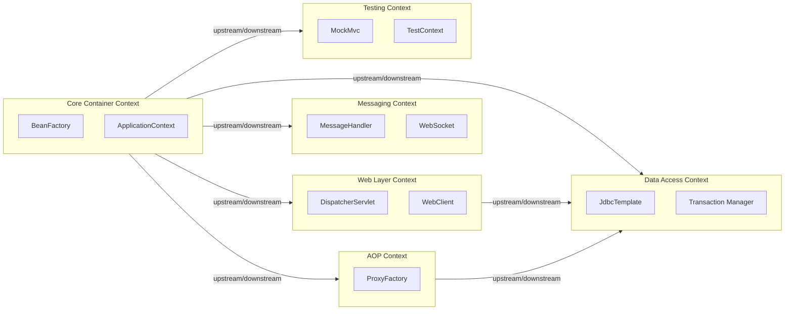
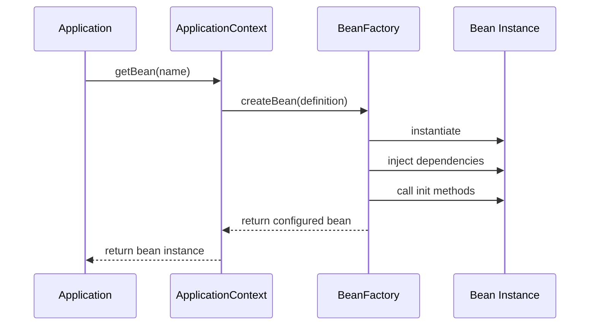
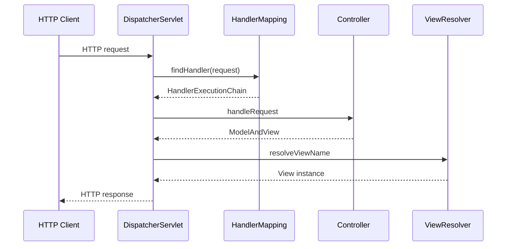
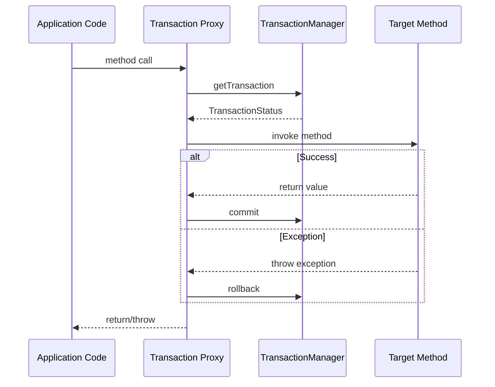

# Product Requirements Document

**Produced for:** Legacy Application Programme (LAP)  
**Date:** 29 April 2026  
**Status:** CRITICAL ANALYSIS MISMATCH  

---

## ⚠️ CRITICAL ISSUE ⚠️

**This PRD is based on an application analysis of the Spring Framework open-source codebase (version 7.1.0-SNAPSHOT), not a legacy application.** The analysis covers the Spring Framework itself — a comprehensive Java application framework that other applications depend upon, not an operational business application serving the programme's requirements.

**Required action:** Re-run the application analysis against the actual legacy application codebase. This PRD should be considered invalid for implementation planning purposes until the correct source material is analysed.

---

## 1. Overview

Based on the available analysis, this document covers the Spring Framework (version 7.1.0-SNAPSHOT) — a comprehensive, open-source application framework and inversion-of-control container for the Java platform. The framework provides foundational infrastructure services including dependency injection, aspect-oriented programming, web MVC, reactive programming, data access, messaging, and testing support that Java/Kotlin applications build upon.

This is **not a legacy business application** but rather the underlying framework technology that such applications might use. The framework serves as infrastructure for downstream application developers rather than providing direct business functionality to end users.

The framework consists of 22 modules covering core IoC containers, web layers (both servlet-based and reactive), data access abstractions, messaging support, transaction management, and testing utilities.

## 2. Actors

| Actor | Description | Primary activities |
|-------|-------------|--------------------|
| Framework developer / contributor | Open-source contributor with commit access | Develops, tests, and maintains framework modules; subject to DCO sign-off |
| Application developer (downstream consumer) | Uses published framework JARs | Integrates framework into applications; consumes published APIs |
| Build system | Gradle 8.x multi-project build | Compiles, tests, packages framework modules |
| GraalVM native image build tools | External AOT processor | Performs build-time optimisation for native images |

## 3. Domain Model

#### 3.1 Bounded Contexts

**Core Container Context**
- **Responsibility** — Bean lifecycle management and dependency injection
- **Key terms** — BeanFactory, ApplicationContext, BeanDefinition, dependency injection, inversion of control
- **Key entities** — BeanFactory, ApplicationContext, BeanDefinition, DefaultListableBeanFactory
- **Criticality** — Core

**Web Layer Context**
- **Responsibility** — HTTP request handling and web application support
- **Key terms** — DispatcherServlet, HandlerMapping, ModelAndView, reactive, WebFlux
- **Key entities** — DispatcherServlet, DispatcherHandler, RestTemplate, WebClient
- **Criticality** — Core

**Data Access Context**
- **Responsibility** — Database integration and transaction management
- **Key terms** — JdbcTemplate, transaction management, ORM integration, reactive data access
- **Key entities** — JdbcTemplate, PlatformTransactionManager, DatabaseClient
- **Criticality** — Core

**Messaging Context**
- **Responsibility** — Message-based communication and WebSocket support
- **Key terms** — MessageChannel, STOMP, WebSocket, JMS integration
- **Key entities** — MessageHandler, StompCommand, JmsTemplate
- **Criticality** — Supporting

**AOP Context**
- **Responsibility** — Aspect-oriented programming and cross-cutting concerns
- **Key terms** — Advisor, Pointcut, Advice, proxy, AspectJ
- **Key entities** — ProxyFactory, AopProxyFactory, MethodInterceptor
- **Criticality** — Supporting

**Testing Context**
- **Responsibility** — Test infrastructure and test utilities
- **Key terms** — TestContext, MockMvc, WebTestClient, test slices
- **Key entities** — MockMvc, WebTestClient, TestContextManager
- **Criticality** — Supporting

#### 3.2 Context Map



#### 3.3 Entities

##### Core Container Context

#### BeanFactory

> Root IoC container interface for accessing application beans

| Property | Type | Required | Constraints | Source |
|----------|------|----------|-------------|--------|
| containsBeanDefinition | method | yes | Returns boolean | application-analysis.md |
| getBean | method | yes | Generic type parameter | application-analysis.md |
| getBeanDefinitionNames | method | yes | Returns String array | application-analysis.md |
| isSingleton | method | yes | Returns boolean | application-analysis.md |

#### ApplicationContext

> Enriched container interface extending BeanFactory with additional capabilities

| Property | Type | Required | Constraints | Source |
|----------|------|----------|-------------|--------|
| messageSource | interface | yes | Extends MessageSource | application-analysis.md |
| applicationEventPublisher | interface | yes | Extends ApplicationEventPublisher | application-analysis.md |
| resourcePatternResolver | interface | yes | Extends ResourcePatternResolver | application-analysis.md |
| environment | interface | yes | Environment abstraction | application-analysis.md |

#### BeanDefinition

> Bean metadata model describing a bean instance

| Property | Type | Required | Constraints | Source |
|----------|------|----------|-------------|--------|
| beanClassName | string | no | Fully qualified class name | application-analysis.md |
| scope | string | no | Singleton, prototype, session, request | application-analysis.md |
| lazyInit | boolean | no | Default false | application-analysis.md |
| dependsOn | string[] | no | Bean dependency names | application-analysis.md |

##### Data Access Context

#### JdbcTemplate

> Core JDBC operations template

| Property | Type | Required | Constraints | Source |
|----------|------|----------|-------------|--------|
| dataSource | DataSource | yes | JDBC DataSource | application-analysis.md |
| queryTimeout | integer | no | Query timeout in seconds | application-analysis.md |
| maxRows | integer | no | Maximum rows to fetch | application-analysis.md |
| fetchSize | integer | no | JDBC fetch size hint | application-analysis.md |

#### PlatformTransactionManager

> Core transaction management interface

| Property | Type | Required | Constraints | Source |
|----------|------|----------|-------------|--------|
| getTransaction | method | yes | Returns TransactionStatus | application-analysis.md |
| commit | method | yes | Commits transaction | application-analysis.md |
| rollback | method | yes | Rolls back transaction | application-analysis.md |

##### Web Layer Context

#### DispatcherServlet

> Central dispatcher for servlet-based web requests

| Property | Type | Required | Constraints | Source |
|----------|------|----------|-------------|--------|
| contextClass | string | no | ApplicationContext implementation class | application-analysis.md |
| contextConfigLocation | string | no | Configuration file locations | application-analysis.md |
| namespace | string | no | Servlet namespace | application-analysis.md |

## 4. Key User Interfaces & Screens

**Note:** As an infrastructure framework, Spring Framework does not provide end-user screens. The interfaces described are programmatic APIs for application developers.

## 5. Business Rules & Processes

#### Core Container Rules

- **BR-001** — Singleton beans are instantiated once per container lifecycle
- **Criticality** — Core  
- **Source** — application-analysis.md

- **BR-002** — Prototype beans are created for each request
- **Criticality** — Core  
- **Source** — application-analysis.md

- **BR-003** — Circular dependencies are detected and resolved through proxy creation
- **Criticality** — Core  
- **Source** — application-analysis.md

#### Transaction Management Rules

- **BR-004** — @Transactional methods execute within transaction boundaries
- **Criticality** — Core  
- **Source** — application-analysis.md

- **BR-005** — Transaction propagation behaviour is controlled by Propagation enum values
- **Criticality** — Core  
- **Source** — application-analysis.md

#### Data Access Rules

- **BR-006** — SQL error codes are translated to Spring's DataAccessException hierarchy
- **Criticality** — Supporting  
- **Source** — application-analysis.md

- **BR-007** — Connection resources are automatically managed by JDBC templates
- **Criticality** — Core  
- **Source** — application-analysis.md

## 6. Workflows

### Bean Lifecycle Management

**Description** — The container instantiates, configures, and manages the lifecycle of application beans according to their definitions and scopes.

**Trigger** — ApplicationContext startup or bean request

**Diagram**


### HTTP Request Processing (Servlet-based)

**Description** — Web requests are dispatched through DispatcherServlet to appropriate handler methods and views.

**Trigger** — HTTP request received

**Diagram**


### Transaction Management

**Description** — Transactional methods are wrapped with transaction boundaries using AOP proxies.

**Trigger** — @Transactional method invocation

**Diagram**


## 7. Computed Fields & Formulas

| Field name | Formula/logic | Where used | Source |
|------------|--------------|------------|--------|
| Bean creation time | Current system timestamp when bean is instantiated | Bean lifecycle logging | application-analysis.md |
| Transaction timeout | Configured timeout value or default from transaction manager | Transaction management | application-analysis.md |
| Retry delay | BackOff algorithm calculation based on attempt count | RetryTemplate | application-analysis.md |
| SQL error classification | Error code mapping to Spring exception hierarchy | SQLErrorCodesFactory | application-analysis.md |

## 8. Reports & Analytics

Spring Framework does not contain operational reporting features. The framework provides view rendering integration for applications to generate reports:

| Report | Purpose | Data sources | Filters/parameters | Output format | Source |
|--------|---------|-------------|-------------------|---------------|--------|
| PDF view rendering | Application-level PDF generation | ModelAndView model map | View-defined parameters | PDF | application-analysis.md |
| Excel view rendering | Application-level spreadsheet generation | ModelAndView model map | View-defined parameters | XLSX | application-analysis.md |
| Atom/RSS feed view | Application-level feed generation | ModelAndView model map | View-defined parameters | XML (Atom/RSS) | application-analysis.md |

## 9. Behaviour

#### Bean Management Features

```gherkin
Scenario: Singleton bean creation
  Given a singleton bean definition is registered
  When the bean is requested multiple times
  Then the same instance is returned for all requests

Scenario: Prototype bean creation  
  Given a prototype bean definition is registered
  When the bean is requested multiple times
  Then a new instance is created for each request

Scenario: Circular dependency resolution
  Given two beans that depend on each other
  When the application context starts up
  Then the circular dependency is resolved through proxy creation
```

#### Transaction Management Features

```gherkin
Scenario: Successful transaction commit
  Given a method annotated with @Transactional
  When the method executes successfully
  Then the transaction is committed

Scenario: Transaction rollback on exception
  Given a method annotated with @Transactional
  When the method throws a RuntimeException
  Then the transaction is rolled back

Scenario: Transaction propagation
  Given a transactional method calls another transactional method
  When propagation is set to REQUIRED
  Then both methods participate in the same transaction
```

#### Data Access Features

```gherkin
Scenario: SQL error code translation
  Given a database operation that fails with vendor-specific error code
  When the error occurs during JdbcTemplate execution
  Then the error is translated to appropriate Spring DataAccessException

Scenario: Connection resource management
  Given a JdbcTemplate operation
  When the operation completes
  Then the database connection is automatically closed
```

## 10. Roles & Permissions

| Role | Description | Permissions |
|------|-------------|-------------|
| Framework developer | Open-source contributor | Read/write access to source code, commit with DCO sign-off |
| Application developer | Framework consumer | Read access to published APIs and documentation |
| Build system | Automated build process | Read source code, execute tests, publish artifacts |

## 11. Security Constraints

- Framework contributors must sign off commits with Developer Certificate of Origin (DCO)
- Published framework artifacts are signed and distributed through Maven Central
- Framework provides integration points for security but does not implement authentication or authorisation itself
- UserRoleAuthorizationInterceptor delegates to HttpServletRequest.isUserInRole() for basic servlet-based role checking

## 12. External Systems & Integrations

| System | Direction | Protocol | Purpose | Source |
|--------|-----------|----------|---------|--------|
| Maven Central | outbound | HTTPS | Published framework JARs and BOMs | application-analysis.md |
| Various databases | bidirectional | JDBC/R2DBC | Database abstraction support | application-analysis.md |
| JMS providers | bidirectional | JMS API | Messaging integration | application-analysis.md |
| Quartz scheduler | bidirectional | In-process | Job scheduling support | application-analysis.md |
| JMX MBean server | outbound | RMI | Management and monitoring | application-analysis.md |
| GraalVM native image tools | outbound | Build-time AOT | Native image compilation | application-analysis.md |
| Micrometer observation | outbound | Various (Zipkin, OTLP) | Metrics and tracing | application-analysis.md |

## 13. API Contracts

As an infrastructure framework, Spring Framework exposes numerous APIs to downstream applications:

| Endpoint | Method | Request shape | Response shape | Error codes | Source |
|----------|--------|--------------|----------------|-------------|--------|
| BeanFactory.getBean() | Java method | String beanName or Class type | Object instance | NoSuchBeanDefinitionException | application-analysis.md |
| JdbcTemplate operations | Java methods | SQL string, parameters | Query results or update counts | DataAccessException hierarchy | application-analysis.md |
| Transaction boundaries | AOP proxies | Method invocation | Method return value | TransactionException hierarchy | application-analysis.md |

## 14. Open Questions

1. **Analysis target mismatch** — The application analysis covers Spring Framework source code rather than a legacy application. Which specific application should be analysed instead?

2. **Missing business context** — Without domain analysis or interaction analysis, there is no information about specific business requirements, processes, or user workflows.

3. **Incomplete analysis set** — This PRD is based solely on application analysis without supporting domain, interaction, or database analyses that would normally inform a comprehensive PRD.

4. **Framework vs application confusion** — Should the LAP programme be analysing applications that use Spring Framework, rather than the framework itself?

## 15. Known Limitations & Deficiencies

Based on the application analysis of Spring Framework:

- This analysis covers infrastructure framework code rather than a business application
- No business-specific deficiencies can be identified without analysing an actual legacy application
- Framework analysis reveals normal software engineering patterns rather than legacy application issues

## 16. Data Migration Considerations

Not applicable — Spring Framework is infrastructure software that does not maintain business data schemas.

## 17. Non-Functional Requirements

Based on framework characteristics:

- **Performance** — Framework designed for enterprise-scale applications with configurable connection pooling, caching, and batch processing
- **Availability** — Framework provides infrastructure for building highly available applications but does not define availability requirements itself
- **Compatibility** — Maintains backwards compatibility within major versions; supports Java 17+ with multi-release JAR optimisations

## 18. Glossary

| Term | Definition |
|------|------------|
| Bean | An object managed by the Spring IoC container |
| Dependency Injection | Design pattern where objects receive their dependencies from external sources rather than creating them |
| Inversion of Control (IoC) | Design principle where control of object creation is inverted to a container |
| ApplicationContext | Central interface providing configuration and management of application beans |
| BeanDefinition | Metadata describing how a bean should be instantiated and configured |
| AOP | Aspect-Oriented Programming - programming paradigm for separating cross-cutting concerns |
| DispatcherServlet | Front controller servlet that dispatches web requests to appropriate handlers |
| Transaction Propagation | Behaviour that defines how transactions behave when called from within existing transactions |
| STOMP | Simple Text Oriented Messaging Protocol for WebSocket communication |
| R2DBC | Reactive Relational Database Connectivity - reactive database access specification |

## 19. Sources

- **output/application-analysis.md** — Generated 29 April 2026, analysed Spring Framework version 7.1.0-SNAPSHOT source code including 22 modules and 5,206 Java source files

**Raw material summary:** Analysis based on Spring Framework open-source codebase rather than legacy application sources.

---

**End of Document**

**⚠️ CRITICAL REMINDER:** This PRD is based on analysis of Spring Framework infrastructure code, not a legacy application. It should not be used for implementation planning without first conducting analysis of the correct source material.