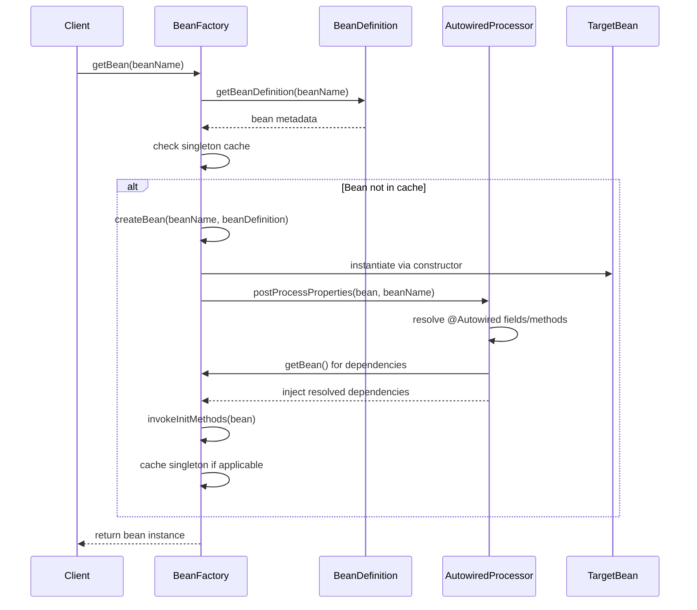
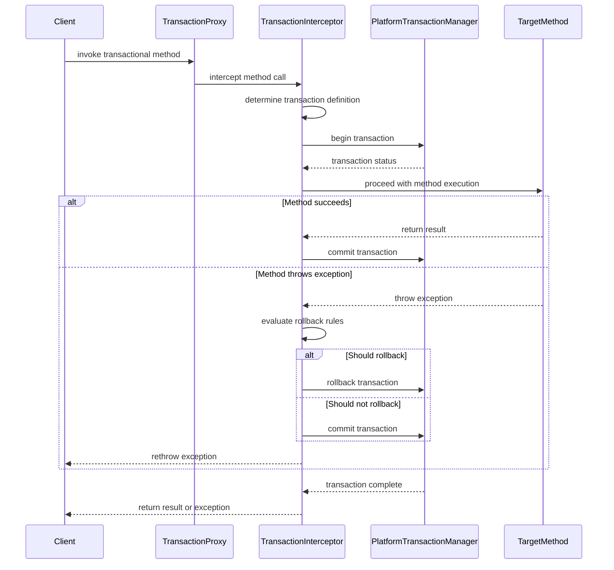
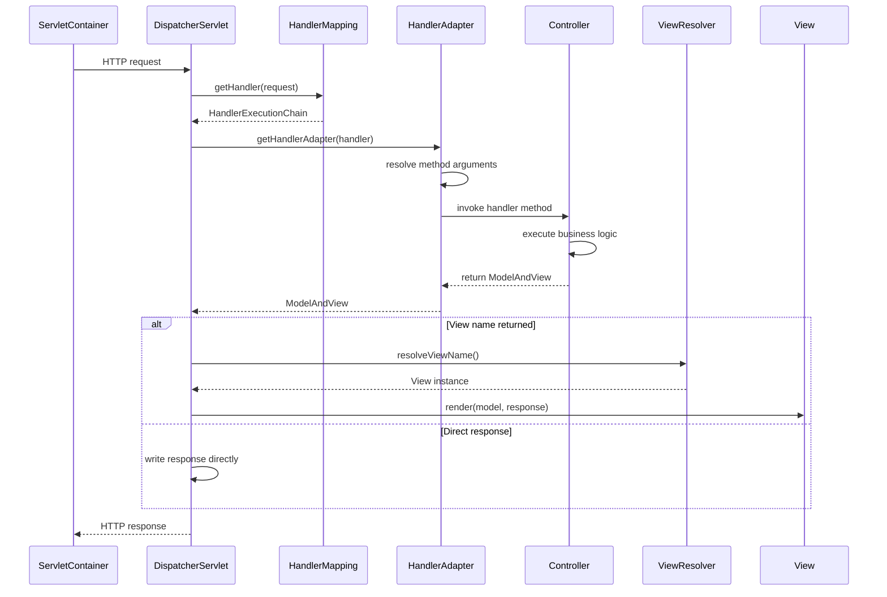
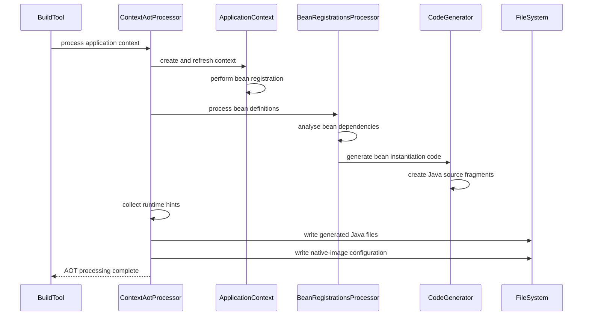
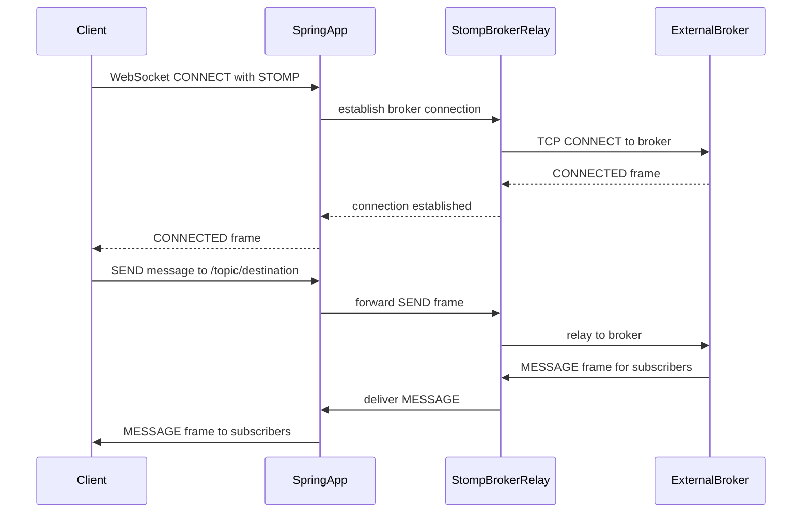

# Spring Framework — Product Requirements Document

**Prepared for:** Legacy Application Programme (LAP)  
**Generation date:** 2026-04-29  
**Analyst:** LAP Product Manager Agent

---

## 1. Overview

Spring Framework is a comprehensive, open-source Java application framework providing foundational infrastructure support for enterprise applications. The framework enables developers to build Java and Kotlin applications with minimal boilerplate through dependency injection, aspect-oriented programming, data access abstractions, web MVC, reactive web programming, messaging, and transaction management capabilities.

The framework serves as the foundational layer for numerous enterprise applications across Defra's application estate. Understanding its internal architecture, capabilities, and extension points is critical for the Legacy Application Programme when modernising Spring-based applications or when considering migration strategies for applications built upon this framework.

The scope of this system covers the complete Spring Framework infrastructure — from the core IoC container through to web, data access, messaging, and integration modules that collectively provide a comprehensive platform for Java enterprise application development.

## 2. Actors

| Actor | Description | Primary activities |
|-------|-------------|--------------------|
| Framework consumer | Application developer using Spring Framework APIs to build applications | Configure beans, inject dependencies, write controllers, define transactions, implement business logic |
| AOT processor | Build-time system component that processes application context for ahead-of-time compilation | Analyse application context, generate optimised Java source code, produce GraalVM native image hints |
| Servlet container | External runtime environment hosting Spring MVC applications | Handle HTTP requests, manage sessions, provide authentication context, delegate to DispatcherServlet |
| Transaction manager | Platform-specific transaction coordinator (JDBC, JTA, etc.) | Begin transactions, commit changes, rollback on failure, coordinate distributed transactions |
| Message broker | External messaging infrastructure for JMS or STOMP communication | Route messages, maintain queues/topics, deliver messages to consumers |
| Database system | Relational database accessed via JDBC, JPA, or R2DBC | Store data, enforce constraints, execute queries, manage transactions |
| Scheduler | Task execution infrastructure for background processing | Execute scheduled methods, manage thread pools, handle recurring tasks |
| Monitoring system | External observability infrastructure consuming Micrometer metrics | Collect application metrics, trace operations, alert on thresholds |

## 3. Domain Model

### 3.1 Bounded Contexts

#### Core Container
- **Responsibility:** Object lifecycle management, dependency injection, and application context coordination
- **Key terms:** Bean, BeanFactory, ApplicationContext, dependency injection, IoC container, bean scope, autowiring
- **Key entities:** BeanDefinition, DefaultListableBeanFactory, ApplicationContext, ConfigurationClassPostProcessor, AutowiredAnnotationBeanPostProcessor
- **Criticality:** Core

#### Aspect-Oriented Programming
- **Responsibility:** Cross-cutting concern implementation through proxy-based and weaving-based AOP
- **Key terms:** Aspect, advice, pointcut, join point, proxy, weaving, AspectJ
- **Key entities:** ProxyFactory, AspectJExpressionPointcut, MethodInterceptor, ReflectiveAspectJAdvisorFactory
- **Criticality:** Core

#### Web Infrastructure
- **Responsibility:** HTTP request processing, REST services, and reactive web programming
- **Key terms:** DispatcherServlet, controller, request mapping, handler, view resolver, reactive programming
- **Key entities:** DispatcherServlet, RequestMappingHandlerMapping, HandlerMethodArgumentResolver, WebClient
- **Criticality:** Core

#### Data Access
- **Responsibility:** Database interaction, transaction management, and persistence abstraction
- **Key terms:** Template pattern, transaction, JDBC, JPA, R2DBC, declarative transaction
- **Key entities:** JdbcTemplate, TransactionManager, EntityManagerFactory, DatabaseClient
- **Criticality:** Core

#### Messaging
- **Responsibility:** Message-based communication and integration patterns
- **Key terms:** Message channel, JMS, WebSocket, STOMP, RSocket, message converter
- **Key entities:** JmsTemplate, MessageChannel, StompSession, RSocketRequester
- **Criticality:** Supporting

#### Expression Language
- **Responsibility:** Runtime expression evaluation and compilation
- **Key terms:** SpEL, expression parser, evaluation context, compilation, AST
- **Key entities:** SpelExpressionParser, ExpressionParser, EvaluationContext, SpelCompiler
- **Criticality:** Supporting

#### Context Support
- **Responsibility:** Optional integrations with third-party libraries and enterprise services
- **Key terms:** Scheduler integration, template engine, cache provider, mail sender
- **Key entities:** SchedulerFactoryBean, FreeMarkerConfigurer, CacheManager, JavaMailSender
- **Criticality:** Peripheral

### 3.2 Context Map

```mermaid
flowchart LR
    subgraph "Core Container"
        CC[Core Container]
    end
    subgraph "AOP"
        AOP[Aspect-Oriented Programming]
    end
    subgraph "Web"
        WEB[Web Infrastructure]
    end
    subgraph "Data"
        DATA[Data Access]
    end
    subgraph "Messaging"
        MSG[Messaging]
    end
    subgraph "Expression"
        EXPR[Expression Language]
    end
    subgraph "Context Support"
        CTX[Context Support]
    end

    CC -- upstream/downstream --> AOP
    CC -- upstream/downstream --> WEB
    CC -- upstream/downstream --> DATA
    CC -- upstream/downstream --> MSG
    CC -- upstream/downstream --> EXPR
    CC -- upstream/downstream --> CTX
    AOP -- shared kernel --- DATA
    WEB -- customer/supplier --> MSG
```

### 3.3 Entities

#### BeanDefinition

> Metadata description for a managed bean within the Spring container

| Property | Type | Required | Constraints | Source |
|----------|------|----------|-------------|--------|
| beanClassName | string | no | Must be a valid Java class name | application-analysis.md |
| scope | enum(singleton, prototype, request, session, application) | yes | Default singleton | application-analysis.md |
| lazy | boolean | no | Default false | application-analysis.md |
| autowireMode | enum(no, byName, byType, constructor) | no | Default no | application-analysis.md |
| dependencyCheck | enum(none, objects, simple, all) | no | Default none | application-analysis.md |
| initMethodName | string | no | Method name for initialisation callback | application-analysis.md |
| destroyMethodName | string | no | Method name for destruction callback | application-analysis.md |

#### TransactionDefinition

> Configuration for declarative transaction management

| Property | Type | Required | Constraints | Source |
|----------|------|----------|-------------|--------|
| propagation | enum(REQUIRED, REQUIRES_NEW, SUPPORTS, NOT_SUPPORTED, MANDATORY, NEVER, NESTED) | yes | Default REQUIRED | application-analysis.md |
| isolation | enum(DEFAULT, READ_UNCOMMITTED, READ_COMMITTED, REPEATABLE_READ, SERIALIZABLE) | yes | Default DEFAULT | application-analysis.md |
| timeout | integer | no | Timeout in seconds, -1 for no timeout | application-analysis.md |
| readOnly | boolean | no | Default false | application-analysis.md |
| rollbackFor | string | no | Exception class names for rollback rules | application-analysis.md |

#### RequestMapping

> Configuration for HTTP request mapping to handler methods

| Property | Type | Required | Constraints | Source |
|----------|------|----------|-------------|--------|
| path | string | no | URL path pattern | application-analysis.md |
| method | enum(GET, POST, PUT, DELETE, PATCH, HEAD, OPTIONS, TRACE) | no | HTTP method constraint | application-analysis.md |
| params | string | no | Request parameter conditions | application-analysis.md |
| headers | string | no | Request header conditions | application-analysis.md |
| consumes | string | no | Content-Type media type constraints | application-analysis.md |
| produces | string | no | Accept media type constraints | application-analysis.md |

#### ScheduledTask

> Configuration for scheduled method execution

| Property | Type | Required | Constraints | Source |
|----------|------|----------|-------------|--------|
| cron | string | no | Cron expression for scheduling | application-analysis.md |
| fixedDelay | integer | no | Fixed delay in milliseconds | application-analysis.md |
| fixedRate | integer | no | Fixed rate in milliseconds | application-analysis.md |
| initialDelay | integer | no | Initial delay before first execution | application-analysis.md |
| timeUnit | enum(NANOSECONDS, MICROSECONDS, MILLISECONDS, SECONDS, MINUTES, HOURS, DAYS) | no | Default MILLISECONDS | application-analysis.md |

## 4. Business Rules & Processes

#### BR-001
- **Statement:** Required properties declared via ConfigurableEnvironment.setRequiredProperties() must resolve before context refresh completes; MissingRequiredPropertiesException is thrown if not
- **Criticality:** Core
- **Source:** application-analysis.md

#### BR-002
- **Statement:** Within a single BeanFactory, singleton bean names must be unique; duplicate registration throws BeanDefinitionOverrideException unless override is explicitly enabled
- **Criticality:** Core
- **Source:** application-analysis.md

#### BR-003
- **Statement:** Circular dependencies among singleton beans using constructor injection are not resolvable; the container throws BeanCurrentlyInCreationException
- **Criticality:** Core
- **Source:** application-analysis.md

#### BR-004
- **Statement:** @Transactional applies only to public methods of proxied beans when using JDK or CGLIB proxies; declaring on package-private or private methods has no effect without AspectJ LTW
- **Criticality:** Core
- **Source:** application-analysis.md

#### BR-005
- **Statement:** Transactions roll back on RuntimeException or Error by default but not on checked exceptions unless custom rollback rules are specified
- **Criticality:** Core
- **Source:** application-analysis.md

#### BR-006
- **Statement:** Methods annotated with @Scheduled must not accept any parameters; the framework throws an exception at startup if parameters are present
- **Criticality:** Core
- **Source:** application-analysis.md

#### BR-007
- **Statement:** Each @Scheduled annotation must specify exactly one of cron, fixedDelay, or fixedRate; multiple triggers on the same annotation are rejected
- **Criticality:** Core
- **Source:** application-analysis.md

#### BR-008
- **Statement:** Two handler methods in the same DispatcherServlet context must not produce identical request-mapping conditions; ambiguity throws an exception at startup
- **Criticality:** Core
- **Source:** application-analysis.md

#### BR-009
- **Statement:** SpEL expressions used in @Value annotations must resolve to non-null values unless a default is specified with ':' syntax
- **Criticality:** Supporting
- **Source:** application-analysis.md

#### BR-010
- **Statement:** Bean post-processors are applied in registration order; Ordered interface or @Order annotation controls processing sequence
- **Criticality:** Supporting
- **Source:** application-analysis.md

#### BR-011
- **Statement:** @Configuration classes must not be final and must have a public no-argument constructor for CGLIB proxy generation
- **Criticality:** Supporting
- **Source:** application-analysis.md

#### BR-012
- **Statement:** JMS listener methods annotated with @JmsListener must accept Message objects or payload types compatible with the configured message converter
- **Criticality:** Supporting
- **Source:** application-analysis.md

## 5. Workflows

### Dependency Injection Resolution

**Description:** The core workflow for resolving and injecting dependencies when creating bean instances within the Spring container. This process handles constructor injection, setter injection, and field injection whilst respecting bean scopes and lifecycle callbacks.

**Trigger:** Bean instantiation request to BeanFactory.getBean() or lazy bean resolution during application context refresh



### Transaction Management Execution

**Description:** The declarative transaction management workflow that intercepts method calls on @Transactional beans, begins transactions, handles rollback conditions, and commits or rolls back based on method outcomes.

**Trigger:** Method invocation on a bean proxied for transaction management



### HTTP Request Processing

**Description:** The Spring MVC workflow for processing incoming HTTP requests through the DispatcherServlet, mapping to appropriate handler methods, resolving method arguments, executing business logic, and rendering responses.

**Trigger:** HTTP request received by servlet container and forwarded to DispatcherServlet



### AOT Build-Time Processing

**Description:** The ahead-of-time compilation workflow that processes application context definitions during build time to generate optimised source code and native image configuration, eliminating runtime reflection and classpath scanning for improved startup performance.

**Trigger:** ContextAotProcessor executed during build pipeline



## 6. Roles & Permissions

| Role | Description | Permissions |
|------|-------------|-------------|
| Framework API consumer | Developer using public Spring Framework APIs | Access all public interfaces, configure beans, implement custom extensions |
| UserRoleAuthorizationInterceptor subject | User authenticated by servlet container | Access restricted by servlet container roles as configured by application |
| PrincipalMethodArgumentResolver subject | Authenticated user with container-provided Principal | Access to Principal object injected into controller method parameters |

**Note:** Spring Framework itself provides no built-in authentication or authorisation mechanisms. Security is implemented through Spring Security (separate project) or container-based security.

## 7. Security Constraints

- Framework consumers have unrestricted access to all public APIs within the framework modules
- UserRoleAuthorizationInterceptor provides basic servlet container role checking when configured by applications
- PrincipalMethodArgumentResolver passes container-authenticated principals to controller methods for application-level access decisions
- No session management, authentication, or authorisation is performed by the framework itself
- Applications using Spring Framework must implement security through Spring Security integration or container-managed security

## 8. External Systems & Integrations

| System | Direction | Protocol | Purpose | Source |
|--------|-----------|----------|---------|--------|
| JDBC Database | bidirectional | JDBC | Relational data access via JdbcTemplate and JdbcClient | application-analysis.md |
| R2DBC Database | bidirectional | R2DBC SPI | Reactive relational database access | application-analysis.md |
| JPA Provider | bidirectional | JPA 3.2 | Object-relational mapping through Hibernate/EclipseLink | application-analysis.md |
| JMS Broker | bidirectional | JMS 3.1 | Message queue integration via JmsTemplate | application-analysis.md |
| WebSocket Server | bidirectional | WebSocket/SockJS | Real-time communication through servlet containers | application-analysis.md |
| STOMP Broker | bidirectional | STOMP over TCP | Message broker relay for WebSocket messaging | application-analysis.md |
| RSocket Peer | bidirectional | RSocket | Reactive messaging over TCP or WebSocket | application-analysis.md |
| HTTP Services | outbound | HTTP/HTTPS | REST client integration via RestTemplate, RestClient, WebClient | application-analysis.md |
| Mail Server | outbound | SMTP/IMAP | Email sending through JavaMail integration | application-analysis.md |
| JMX Agent | bidirectional | JMX | Management and monitoring through MBean exposure | application-analysis.md |
| JNDI Service | inbound | JNDI | Naming service lookup for datasources and EJBs | application-analysis.md |
| Quartz Scheduler | bidirectional | In-process/clustered | Advanced job scheduling beyond @Scheduled | application-analysis.md |
| Micrometer Registry | outbound | Micrometer API | Metrics and observability data export | application-analysis.md |
| GraalVM Native Image | outbound | Build-time | Native compilation hints and configuration | application-analysis.md |

### STOMP Broker Integration Flow



## 9. API Contracts

| Endpoint | Method | Request shape | Response shape | Error codes | Source |
|----------|--------|--------------|----------------|-------------|--------|
| DispatcherServlet | GET/POST/PUT/DELETE | HttpServletRequest (varies by handler mapping) | HttpServletResponse (varies by handler return type) | Standard HTTP status codes | application-analysis.md |
| WebFlux DispatcherHandler | GET/POST/PUT/DELETE | ServerRequest (reactive) | ServerResponse (reactive) | Standard HTTP status codes | application-analysis.md |

**Note:** Spring Framework provides infrastructure for creating APIs but does not expose fixed API contracts itself. Actual API contracts are defined by applications built on the framework.

## 10. Computed Fields & Formulas

| Field name | Formula/logic | Where used | Source |
|------------|--------------|------------|--------|
| Bean creation time | System.currentTimeMillis() at instantiation | Bean factory singleton tracking | application-analysis.md |
| Transaction timeout | Current time + timeout seconds from @Transactional annotation | Transaction management | application-analysis.md |
| SpEL expression result | Compile-time AST evaluation or runtime interpretation | @Value resolution, cache keys, security expressions | application-analysis.md |
| Handler method score | Path pattern specificity + HTTP method specificity + parameter constraints | Request mapping resolution | application-analysis.md |
| Retry delay | Base delay × (multiplier ^ attempt number) + jitter | @Retryable annotation processing | application-analysis.md |

## 11. Behaviour

### Bean Lifecycle Management

```gherkin
Scenario: Singleton bean instantiation
  Given a bean definition with singleton scope
  When the bean is requested for the first time
  Then the container creates exactly one instance
  And subsequent requests return the same instance

Scenario: Prototype bean instantiation  
  Given a bean definition with prototype scope
  When the bean is requested multiple times
  Then the container creates a new instance for each request

Scenario: Constructor dependency injection
  Given a bean with constructor parameters marked @Autowired
  When the container instantiates the bean
  Then dependencies are resolved and injected via constructor
  And the bean is fully initialised upon creation

Scenario: Circular dependency detection
  Given two singleton beans with constructor injection dependencies on each other
  When the container attempts to create either bean
  Then a BeanCurrentlyInCreationException is thrown
```

### Transaction Management

```gherkin
Scenario: Successful transaction commit
  Given a method annotated with @Transactional
  When the method executes without throwing exceptions
  Then the transaction is committed automatically
  And all database changes are persisted

Scenario: Automatic rollback on RuntimeException
  Given a method annotated with @Transactional
  When the method throws a RuntimeException
  Then the transaction is rolled back automatically
  And all database changes are discarded

Scenario: No rollback on checked exception
  Given a method annotated with @Transactional (default configuration)
  When the method throws a checked exception
  Then the transaction is committed
  And database changes are persisted despite the exception

Scenario: Custom rollback rules
  Given a method with @Transactional(rollbackFor = IOException.class)
  When the method throws an IOException
  Then the transaction is rolled back
  And database changes are discarded
```

### Request Mapping Resolution

```gherkin
Scenario: Unique request mapping registration
  Given two controller methods with identical @RequestMapping annotations
  When the application context starts up
  Then an IllegalStateException is thrown
  And the application fails to start

Scenario: Path variable extraction
  Given a request mapping with path "/users/{id}"
  When a request is made to "/users/123"
  Then the path variable "id" is extracted as "123"
  And injected into the handler method parameter

Scenario: Content negotiation
  Given a controller method with @RequestMapping(produces = "application/json")
  When a request is made with Accept header "text/xml"
  Then a 406 Not Acceptable response is returned
  And no handler method is executed
```

### Scheduled Task Execution

```gherkin
Scenario: Fixed rate scheduling
  Given a method annotated with @Scheduled(fixedRate = 1000)
  When the scheduler is active
  Then the method executes every 1000 milliseconds
  And executions are not delayed by previous execution time

Scenario: Fixed delay scheduling
  Given a method annotated with @Scheduled(fixedDelay = 1000)
  When the scheduler is active
  Then the method waits 1000 milliseconds after each execution completes
  And next execution starts only after the delay period

Scenario: Cron expression scheduling
  Given a method annotated with @Scheduled(cron = "0 0 12 * * ?")
  When the scheduler is active
  Then the method executes every day at 12:00 PM
  And follows the exact cron schedule timing
```

## 12. Open Questions

1. **Configuration Override Behaviour** — The analysis describes bean definition override exceptions but does not specify under what exact conditions overrides are permitted or how the allowBeanDefinitionOverriding flag affects different bean registration scenarios.

2. **Transaction Propagation Edge Cases** — While transaction propagation types are listed, the analysis lacks detail on how nested @Transactional methods interact when they specify conflicting propagation requirements, particularly for REQUIRES_NEW and NESTED scenarios.

3. **AOT Compilation Completeness** — The analysis describes AOT processing workflow but does not clarify which Spring features are fully supported in native image compilation and which require runtime reflection or have limitations.

4. **WebFlux vs MVC Integration** — The analysis covers both reactive and servlet stacks separately but does not address how applications can safely combine WebFlux and Spring MVC components or potential conflicts between the two programming models.

5. **Error Handling Strategies** — While exception scenarios are mentioned for various components, there is insufficient detail on global error handling mechanisms, exception resolver chains, and how errors propagate through the framework layers.

6. **Performance Characteristics** — The analysis does not provide information about performance benchmarks, memory usage patterns, or scalability limits for different configuration approaches (annotation vs XML vs programmatic configuration).

7. **Version Compatibility** — With the codebase targeting Spring Framework 7.1.0-SNAPSHOT, there is no information about backward compatibility guarantees or migration considerations from earlier versions that might be in use across the Defra estate.

## 13. Known Limitations & Deficiencies

- Constructor circular dependencies cannot be resolved for singleton beans, requiring setter injection workarounds for complex dependency graphs
- @Transactional annotations have no effect on package-private or private methods when using proxy-based AOP, which can lead to silent transaction management failures
- SpEL expressions without default values will cause application startup failures if the expression cannot be resolved, with limited diagnostic information
- @Scheduled methods cannot accept parameters, limiting flexibility for parameterised scheduled tasks
- Request mapping ambiguities cause application startup failures rather than runtime resolution, potentially impacting deployment in dynamic routing scenarios
- AOT processing may not support all reflection-heavy Spring features, particularly dynamic proxy generation and runtime configuration changes

## 14. Non-Functional Requirements

**Performance**
- Bean creation overhead varies by scope type (singleton cached, prototype per-request)  
- Transaction overhead depends on transaction manager implementation and isolation level
- SpEL expression compilation to bytecode improves performance for repeated evaluations
- AOT processing eliminates classpath scanning overhead at runtime

**Availability**  
- Framework provides no built-in high availability mechanisms
- Applications must implement clustering and failover at the application level
- Scheduled tasks are not cluster-aware without external coordination

**Audit and Logging**
- Transaction events can be captured through TransactionSynchronization callbacks
- Application events provide audit trails for context lifecycle and custom business events  
- Micrometer integration enables metrics collection and distributed tracing

## 15. Glossary

| Term | Definition |
|------|------------|
| Bean | An object instantiated, assembled, and managed by the Spring IoC container |
| BeanFactory | The root interface for accessing the Spring container and retrieving beans |
| ApplicationContext | Extended version of BeanFactory providing additional enterprise features |
| Dependency Injection | Design pattern where object dependencies are provided by external assembler rather than created internally |
| Inversion of Control | Principle where control of object creation and lifecycle is inverted from application code to framework |
| Aspect | Modularisation of cross-cutting concerns that can be applied across multiple objects |
| Advice | Action taken by an aspect at a particular join point (before, after, around method execution) |
| Pointcut | Predicate that matches join points where advice should be applied |
| Proxy | Wrapper object created by Spring to add aspect behaviour around target bean |
| Transaction Propagation | Behaviour defining how transactions relate to each other when multiple transactional methods are involved |
| Handler Mapping | Component responsible for mapping HTTP requests to appropriate handler methods |
| View Resolver | Component that resolves logical view names to actual view implementations |
| Message Channel | Abstraction for sending messages between components in messaging infrastructure |
| SpEL | Spring Expression Language for evaluating expressions against objects at runtime |
| AOT | Ahead-of-time compilation for generating optimised code and configuration at build time |

## 16. Sources

- `/Users/christopherrooney/legacy-mig/output/v2/application-analysis.md` — Generated 2026-04-29; comprehensive analysis of Spring Framework 7.1.0-SNAPSHOT source code covering application overview, features, business rules, workflows, integration points, and technical architecture; processed approximately 5,206 Java source files across all Spring modules including core, beans, context, AOP, web, data access, messaging, and testing components

**Raw material summary:** Analysis processed build configuration files, properties files, Spring factories configuration, native image configuration, and Java source files representing the complete Spring Framework infrastructure codebase.